This page will explain the LtMAO tool made by Tarngaina and all of its features.

---
## Download and Installation

1. Download [LtMAO-hai.zip](https://github.com/tarngaina/LtMAO/archive/refs/heads/hai.zip)
2. Extract `LtMAO-hai.zip`
3. Run `LtMAO/start.bat`

- [LtMAO GitHub page](https://github.com/tarngaina/LtMAO?tab=readme-ov-file)
---
## cslmao
:::danger
Please make sure to use the updated cslol version in order to work with vanguard!
:::
### Update cslmao
  copy cslol/mod-tools.exe to ltmao/resources/ext-tools
  
### Info

Just [cslol-manager](/core-guides/tools/cslolmanager), but different UI.

:::caution
You need to set the Game folder in the settings tab first for this to work.
:::

  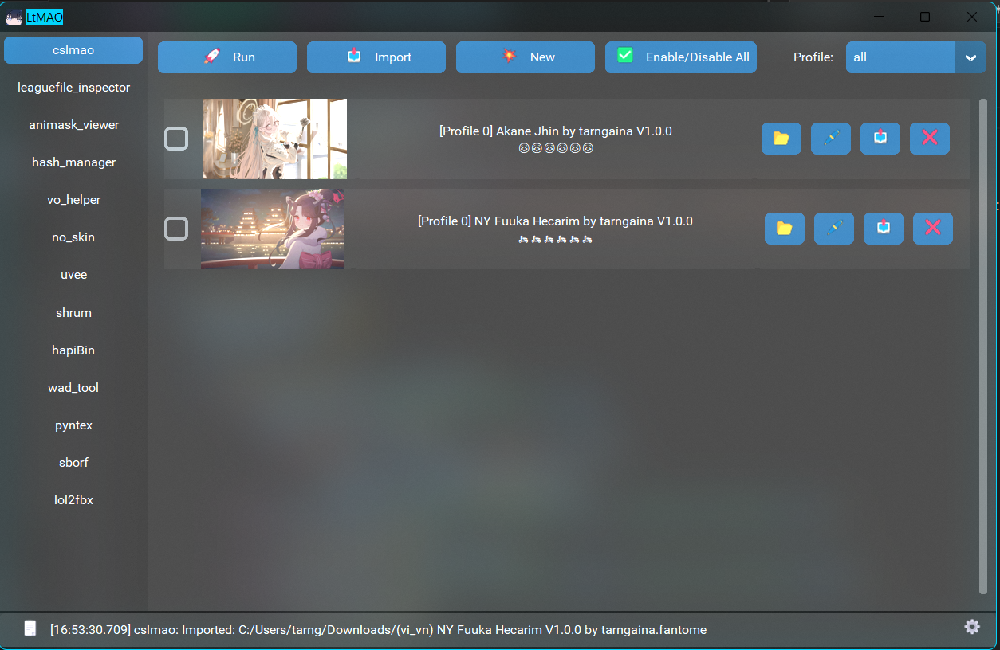
  
 ---
## leaguefile_inspector
  View League files information.
  
  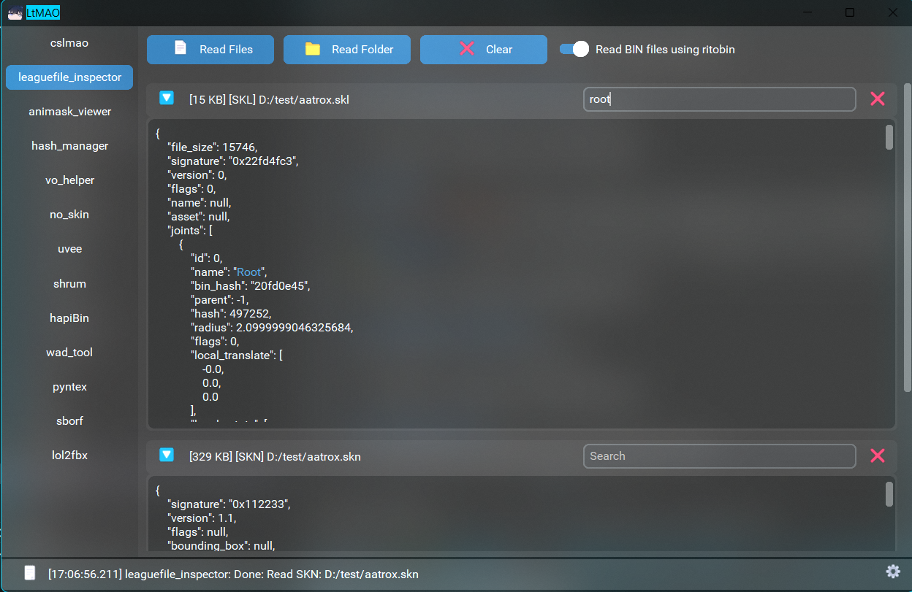
  
 ---
## animask_viewer
  Edit MaskData's weights inside animation BINs.
  
  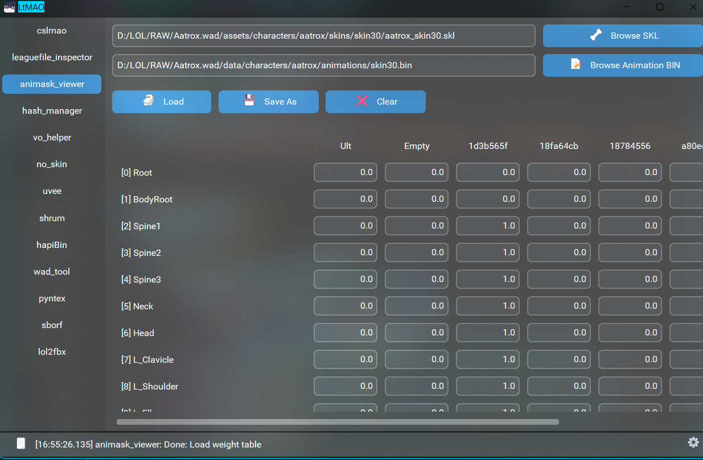
  
 ---
## hash_manager
  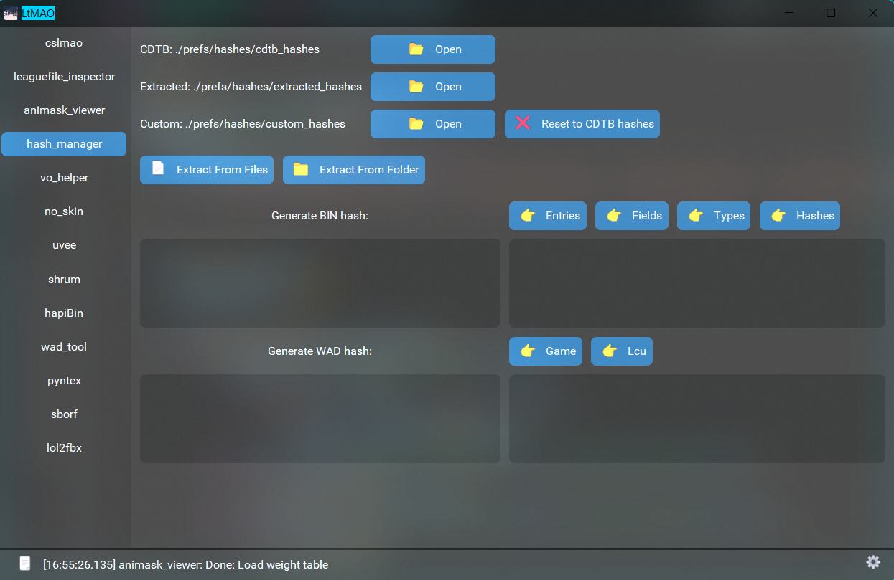

:::caution
Wait for all syncing/updating/loading of hashes to finish before proceeding with any LtMAO functions.
:::

1. CDTB Hashes: Auto sync [CommunityDragon](https://github.com/CommunityDragon/CDTB/tree/master/cdragontoolbox) hashes. Can also be manually downloaded at mentioned link.

2. Extracted Hashes: Extract personally by user.

   Hashes that can be extracted:

	- binentries:
		+ VfxSystemDefinitionData -> particlePath in BIN.
		+ StaticMaterialDef -> name in BIN.
	- binhashes:
		+ Joint hashes -> joint names in SKL.
		+ Submesh hashes -> submesh names in SKN.
	- game:
		+ File path that starts with <kbd style="background-color:#343942">assets/</kbd> or <kbd style="background-color:#343942">data/</kbd> in BIN. If file type is [.dds](/specific-guide/filetypes), extract 2x, 4x dds too.

3. Custom Hashes:

 	- Custom Hashes is hashes that used with all LtMAO related functions: leaguefile_inspector, ritobin, wad_tool,...
   
	 - Custom Hashes = CDTB Hashes + Extracted Hashes + User Manually Added Hashes

Also has generate wad & bin hash function. Those generated hashes can be added to Custom Hashes with <kbd style="background-color:#343942">-></kbd> buttons.
   
 ---
## vo_helper
Make the fantome work on all languages by cloning it.

:::caution
The audio inside the fantome must also come with an events file to make it work on other languages.
:::
    
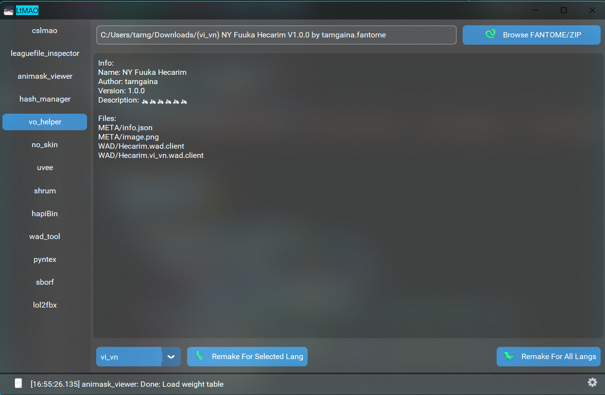
    
 ---
## no_skin
  Creates a mod that disables (almost) all riot skins and turns every champion to the default skin.
    
<kbd style="background-color:#343942">SKIPS.json</kbd>: Some skins cause League to crash when they get changed to base. This file tells the program to not change those skins to base.
  
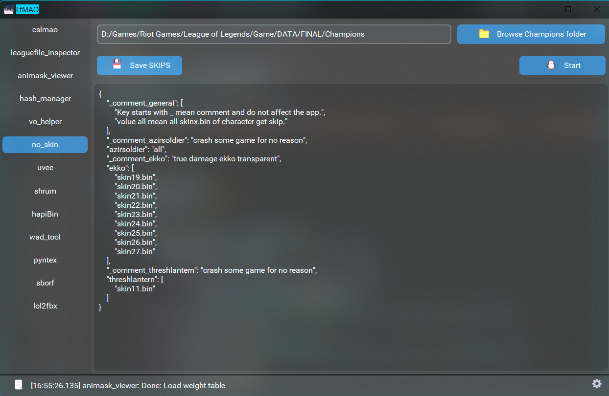
    
  Use it by clicking "Browse Champions folder" button and locating the Champions folder inside the game installation address.
:::note
The address should look like this: "\Riot Games\League of Legends\Game\DATA\FINAL\Champions"
:::
  
Press the Start button and select the folder where you want the mod to be created.
  
  After the operation is completed select the .fantome file you got and put it in CsLol or cslmao.
    
 ---
## uvee
Extract UVs from skn/sco/scb as png files.
    
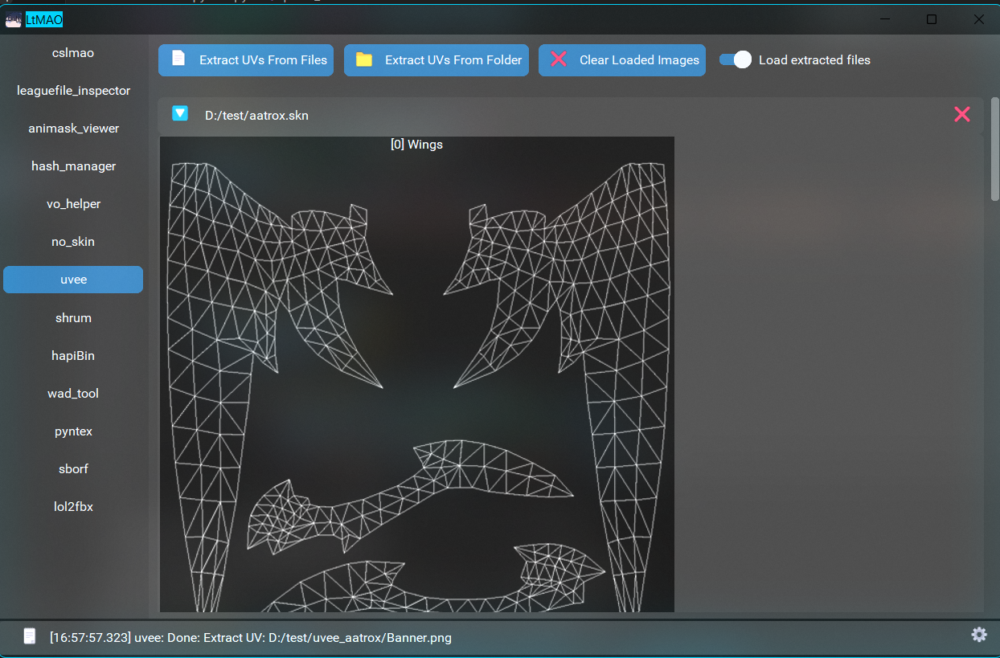
    
 ---

## shrum
Rename joints in ANM using old names & new names input.

Can load SKL as inputs.
    
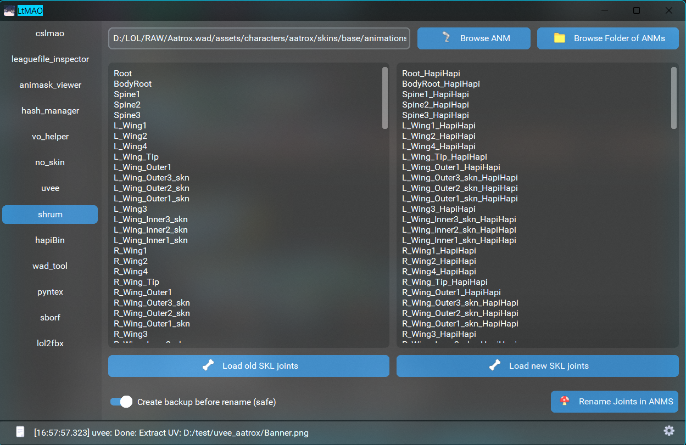
    
 ---
## hapiBin
An app with multiple functions related to updating BIN file:

- Copy linked list.
- Copy vfx colors.

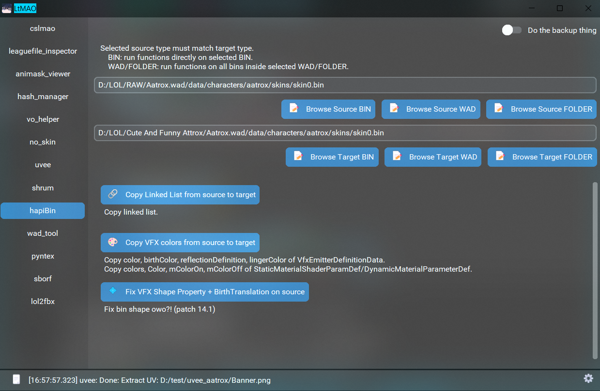
    
 ---

## wad_tool
  Simple tool to unpack and pack WAD files.

Can bulk unpack multiple WADs into same output. Example: Bulk unpacking all voiced wad then throw into vo_helper is a fast way to create a champion voicepack for specific language mod.

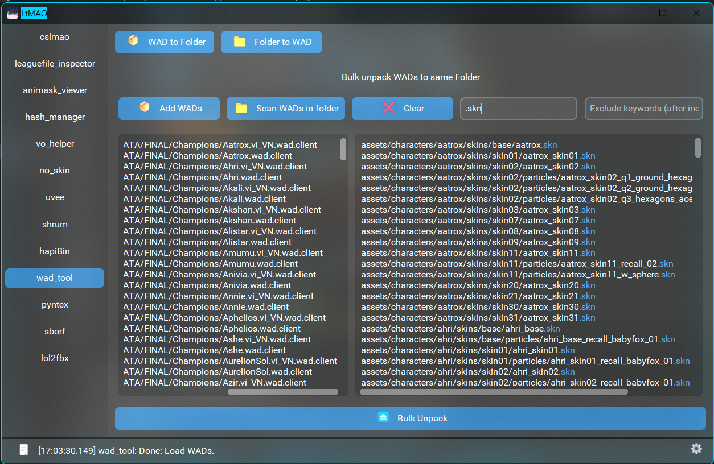
    
 ---

## pyntex
[Hacksaw/bintex](/core-guides/tools/hacksaw) but rewritten. Print out mentioned & missing files in all BINs inside a WAD or a Folder.

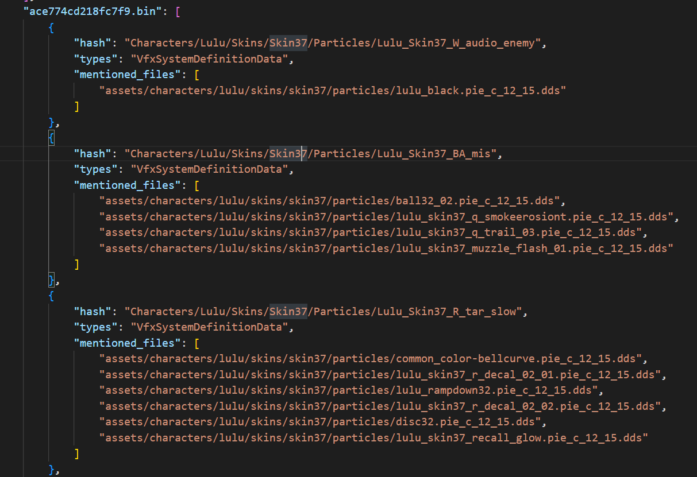
    
 ---

## sborf
Fix skin based on rito files: moonwalk animations, layering animations,...
    
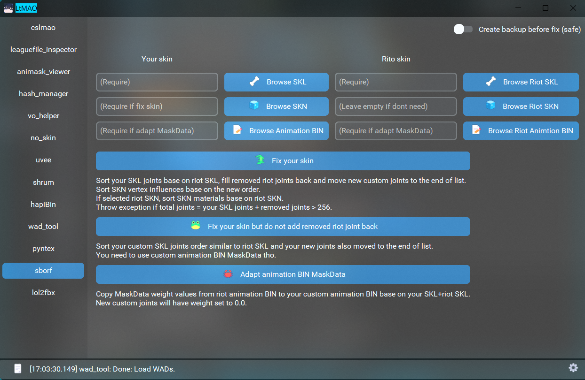
    
 ---
    
## lol2fbx
Convert League .skn and .skl files to FBX and vice versa.
    
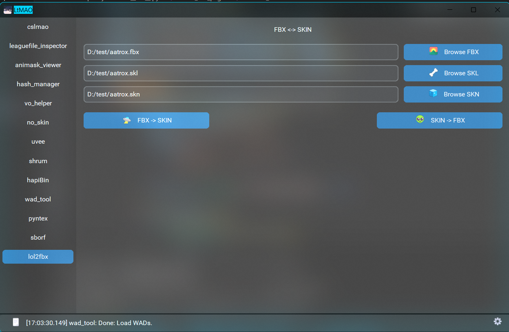
    
    
 ---
## Explorer contexts
    
For some guides on this wiki, you will need the file explorer contexts to make things easier. You can enable them by running LtMAO throught the shortcut as Admin, going to the settings and clicking this button.
    
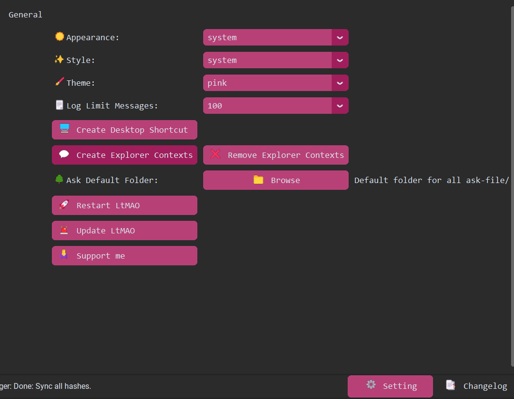 
    
After this, you should see LtMAO options when right clicking a directory or file.
    
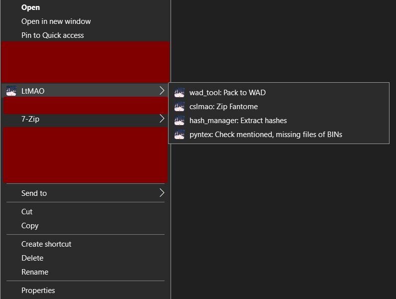 

---
## issues
If you have any issues or questions you can ask for help on the RuneForge discord.
