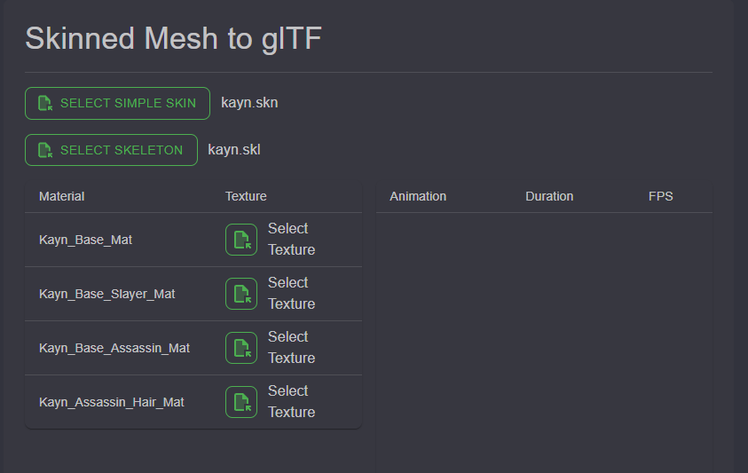
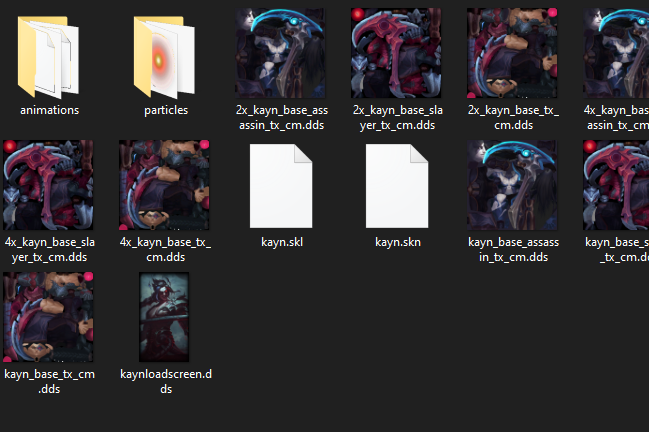
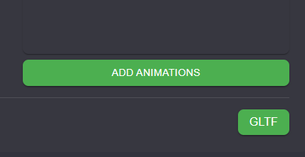
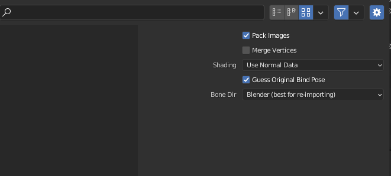
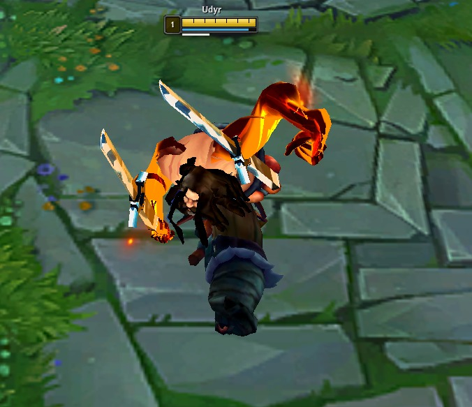

This page will explain lol2gltf and its features
## Tool Instalation
:::note
Download: [lol2gltf](https://github.com/Crauzer/lol2gltf/releases/download/3.0.3/lol2gltf_3.0.3.zip), [lol2gltfCLI](https://github.com/Crauzer/lol2gltf/releases/download/3.0.3/lol2gltf.CLI_3.0.3.zip) **(DOWNLOAD BOTH)**
[Github Page](https://github.com/Crauzer/lol2gltf/releases)
:::

- Create a folder called "lol2gltf"
 - Extract both <kbd>lol2gltf.zip</kbd> and <kbd>lol2gltf.CLI.zip</kbd> into the folder
- lol2gltf is now ready to be used by clicking "lol2gltf.exe"
:::note
In order to be able to use lol2gltf you need to be able to  extract all the files using [Obsidian](/core-guides/tools/obsidian)(check guide)
:::

## Convert .skn to gltf
- Open <kbd>lol2gltf</kbd>
- Resize the window as needed then click on `Select Simple Skin`
- Select the .skn you extracted from Obsidian(if you extracted Kayn and you wanted his base skin for example, you would pick the <kbd>kayn.skn</kbd> from <kbd>assets/character/kayn/skin/base</kbd>
- After that, click `Select Skeleton` and select said skeleton(it should appear without searching)

- Following that, you need to select the textures for the champion. Most of them have only one, but you can encounter ones with more than 1 Material like Udyr or Kayn. Make sure to select the correct ones as most are pretty self explanatory *(<kbd>kayn_Base_Assasin_tx_cm.dds</kbd> is the assasin form for example, and both <kbd>_Base_Assasin_Mat</kbd> and <kbd>_Assasin Hair_Mat</kbd> use that same image)*

- You can also choose to add an animation if you wish to do so by scrolling and clicking `Add Animation`
- Once you got everything you want selected, click `GLTF` and select where you want the file to be exported to

- The file is now exported where you selected with the <kbd>.glb</kbd> file format.
## Importing to blender
:::caution
 When importing to blender, remember to put the `Bone Dir` to  <kbd>Blender(best for re-importing)</kbd> 
If you forget to do so, the bones will be adjusted for blender, and during re importion, it will deform your skin
**This is only needed for Blender versions under 4.0**
:::

## Exporting from .gltf to .skn
- Save the 3D Model in Blender as a GLTF 2.0  file
- Modify the following command to fit your files
`lol2gltf.CLI.exe gltf2skn -g "skin exported from blender" -m "league of legends .skn file"`
For my example, the command would be
`lol2gltf.CLI.exe gltf2skn -g "C:\Users\manue\Desktop\Nova pasta\briar_import.glb" -m "C:\Users\manue\Desktop\Nova pasta\SKIN EXPORT\briar_base.skn"`
- Go to the <kbd>lol2gltf</kbd> folder
- Click on the search bar, and type "cmd" as shown below

- A command box should appear
- Paste the command from before
- If it worked, it created a <kbd>.skn</kbd> and <kbd>.skl</kbd> file on the export location you provided

##### If it didnt work, check the following
- Make sure there is only one single mesh, parented to one skeleton
- Make sure the command is correct, and no <kbd>"</kbd> are missing or spelling mistakes are made
- If you can't find the problem, don't hesitate to ask for help on Runeforge's discord

## List of common errors

> `Unhandled exception. System.ArgumentException: Parameter "LogicalMeshes" (System.Collections.Generic.IReadOnlyCollection<SharpGLTF.Schema2.Mesh>) must have a size equal to 1, had a size of <X>. (Parameter 'LogicalMeshes')` 

File is not a single mesh, join all meshes
> Opening `lol2gltf.exe` and it only shows a white screen

`lol2gltf` and `Obsidian` can't be opened at the same time

