This guide will help you in replacing your champion with a new character, like a character from another game. It would also work with other league champions!

## Required Tools

- [Obsidian to extract and browse League's game files.](/core-guides/tools/obsidian)

Plus **one** 3D program of your choice:

- [Maya 2023 to create, edit, animate, or rig 3D models](/core-guides/tools/maya) with the [lemon3d Plugin made by tarngaina](https://github.com/tarngaina/LtMAO)
- [Blender to create, edit, animate, or rig 3D models](/core-guides/tools/blender)

I will be using Maya for this guide.

## Finding Your Model

You will want to first choose a character and find a model for it. In this guide, I will be swapping Zeri with Cuphead!

You might be able to find your character by searching "(Character Name) 3D model" in Google. If you cannot find it, you might have to create it yourself!

Here are a few sites to help you find some cool models:

- [Model Resource](https://www.models-resource.com)

- [DeviantArt](https://www.deviantart.com)

## Setting Up Your Model

First, I would recommend loading your new model in an empty scene to check if everything is in order.

If your model has no [.skl](/specific-guide/filetypes) and is standing upright in the middle of the scene, then you won.

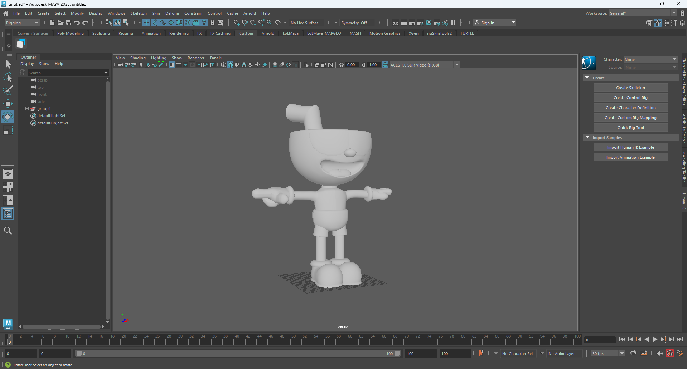

If Lose

Here, my model is not upright and already has a skeleton, so I will first start by fixing those issues.

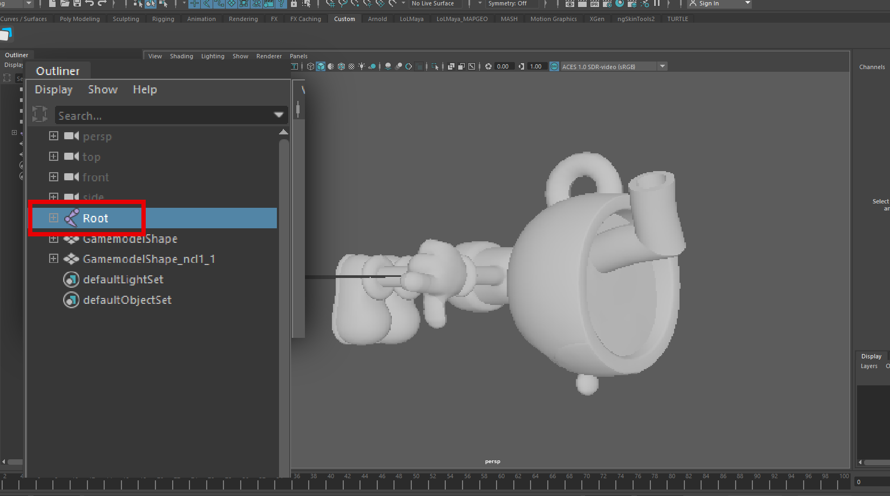

If your model already has a skeleton, you will first need to unbind it before doing any sort of movement. 

First, select every part of your mesh, then in the Rigging tab, you will find Skin > Unbind Skin.

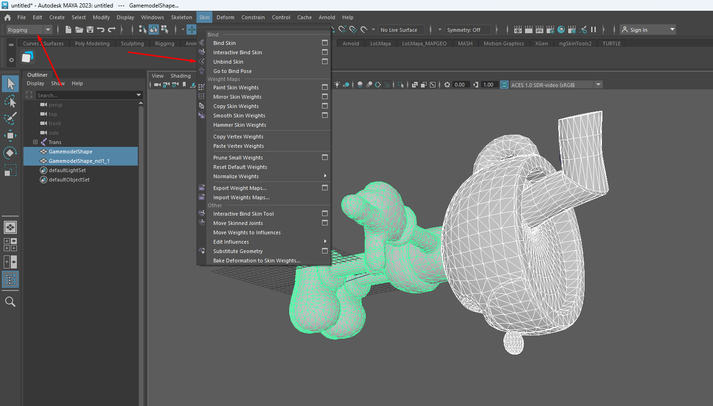

You can then delete the skeleton as it is no longer needed.

Next, you will want to make your character upright (if it is not already). It is possible that your mesh will have multiple different parts; this will complicate things if you simply try to rotate it. 

First, group your meshes, select all your meshes by drag-selecting, then press `Ctrl+G` or go to Edit > Group. 

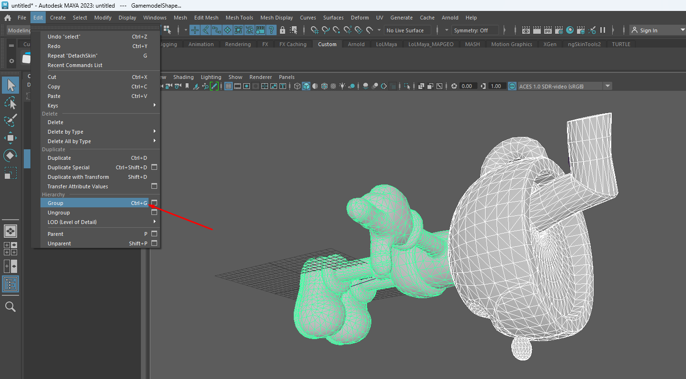

This will create a group that you can select with a pivot in the center of your scene, allowing you to easily rotate your model! (You can hold "J" while rotating to rotate on hard angles.)

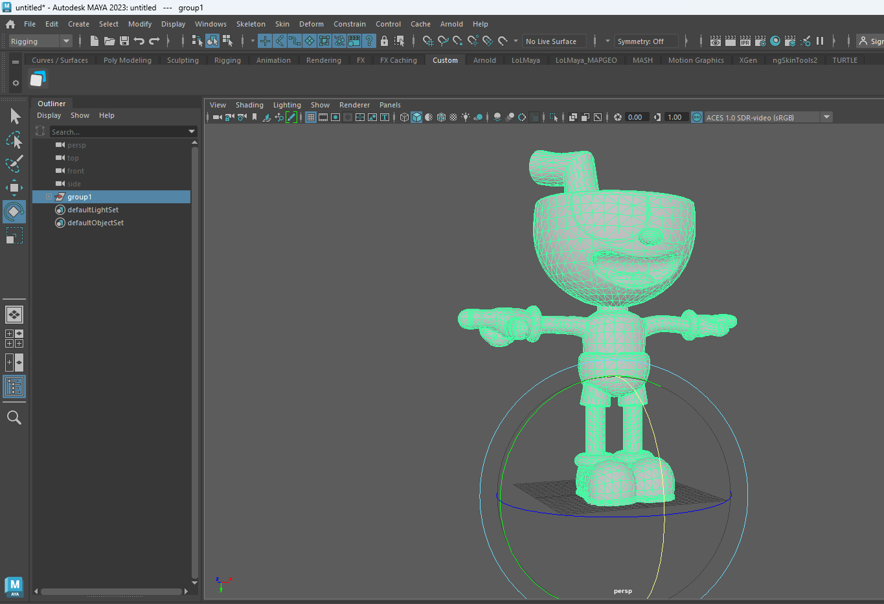

With your model now boneless and standing straight, you can export it as `fbx`, `obj`, or any other format Maya can read!

With the group or mesh selected, go to File > Export Selected and select the file type.

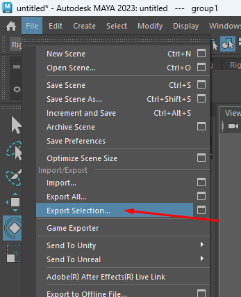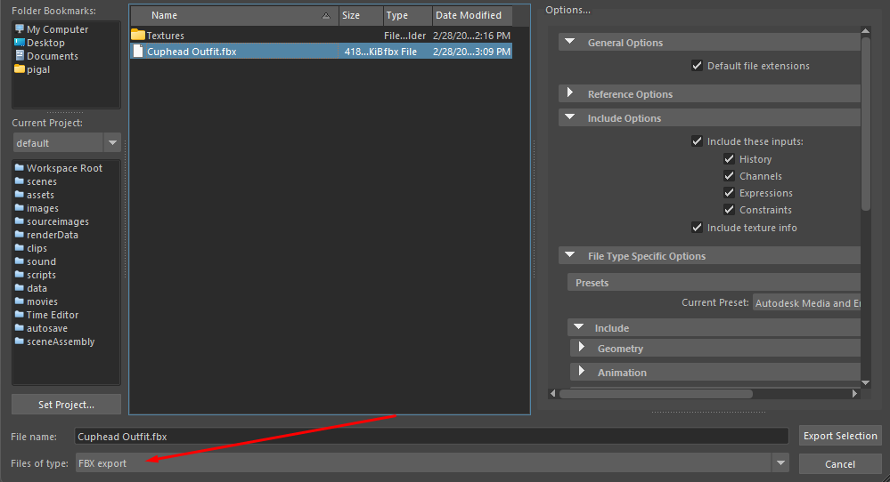  

## Replacing the Model

After saving your custom model, you can open a new scene and load your desired League champion by dragging and dropping the [.skn](/specific-guide/filetypes) into it (this will also import the [.skl](/specific-guide/filetypes) automatically).

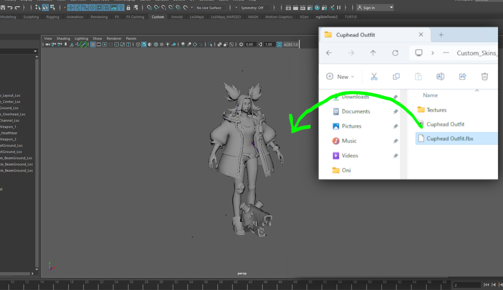

After importing, your model might be bigger or smaller than your League champion. In my case, the model is way smaller. 

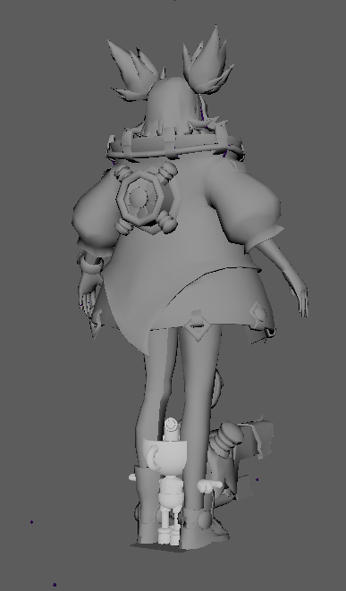 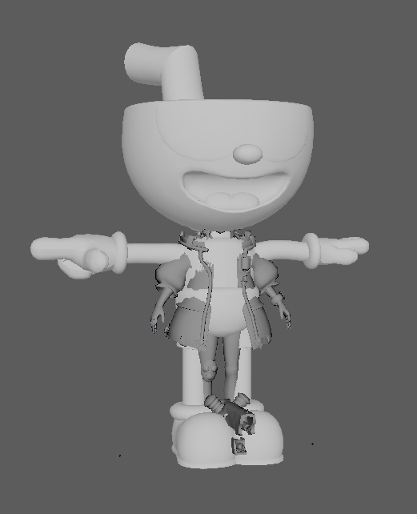
You will want to make sure your custom model fits your League champion as well as possible. Something like shoulder-to-shoulder is what you aim for. 

:::caution
Scale your model! Not the League champion!
:::

Once that's done, you can hide the champion model for now. In the Outliner, select the League champion and press `h`.

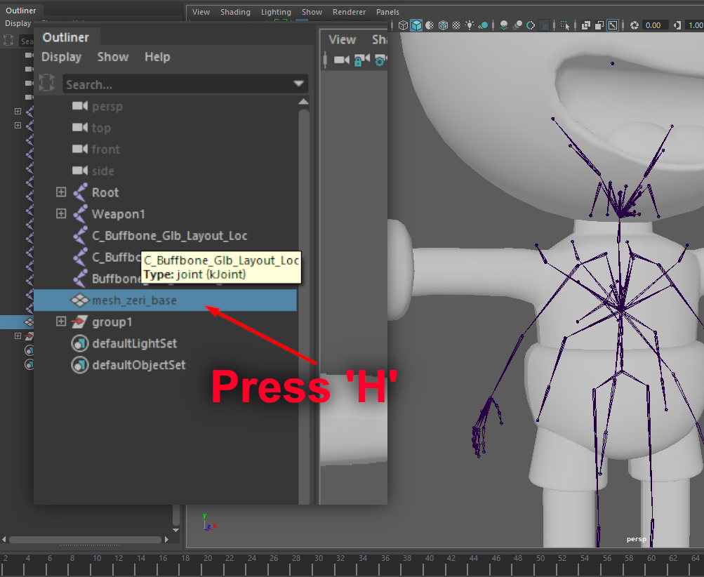

Now that the model is hidden, press the little Bone button so you can see your skeleton through the model.

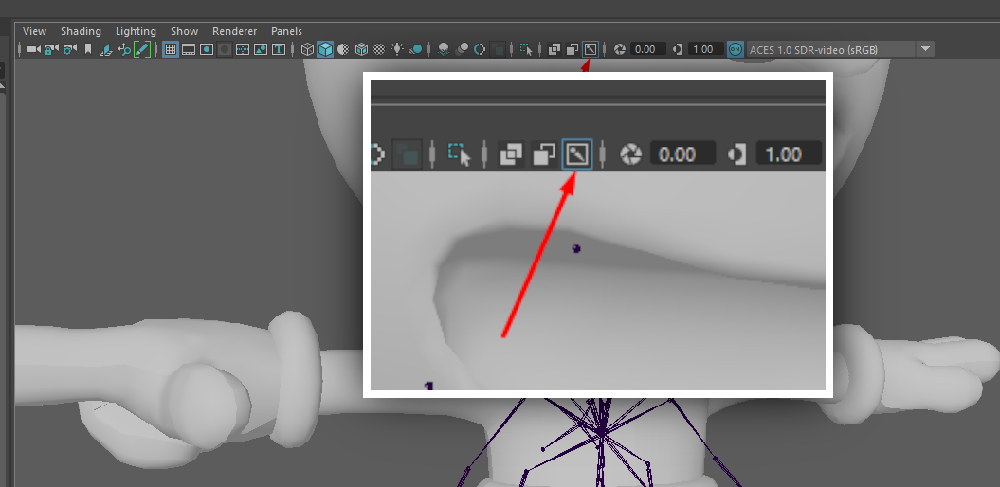

### Cleaning Up the Skeleton

:::caution
This next step is optional, and I recommend doing it ONLY if you know what you are doing!
:::

Cleaning Up the Skeleton

You may notice that there are a lot of joints in the original model, but we don't really need all of those, and it will make the next few steps slightly easier if we remove some of them.

For example, I don't need the bones for the coat, the hair, and the fingers, so I'll be removing them.

Simply select the bones you want to remove and press backspace!

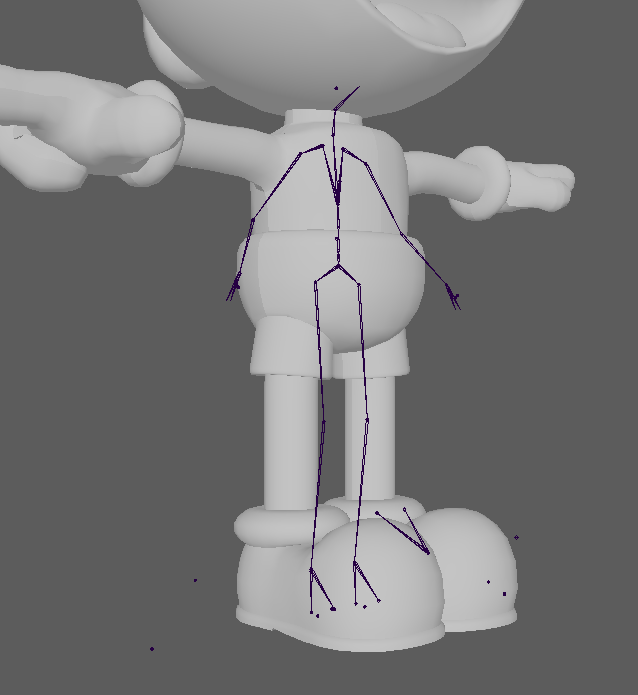

Also, you may notice a few BUFFBONES here and there; do not delete those! These are used for the particle effects!

## Placing the Bones

Now, you may have noticed that the bones don't really align with my character, so let's move them!

In general, you want the elbow bone where the elbow is, the hip bone where the hip is, etc.

You can use the Rotate tool to make them align with your character as much as possible.

If the arms are too long or too short, scale them to make them fit the skeleton.

You want your character to fit the skeleton as much as possible! It's going to influence the quality a lot!

Before (left) and after (right):

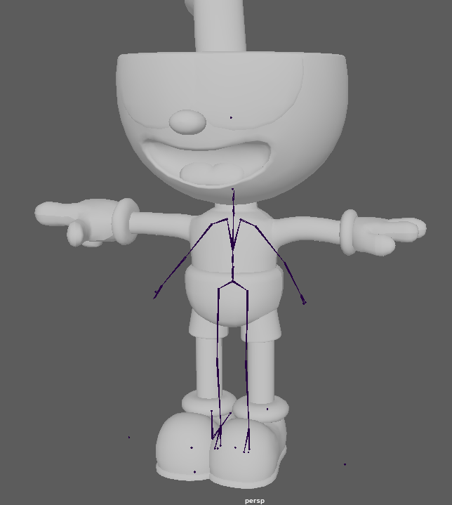 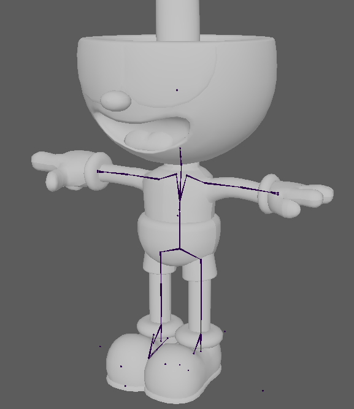

If Your Champion Has a Weapon

It's fairly simple! For example, Yasuo has a sword; to replace it, simply add your desired weapon over the weapon bone! 

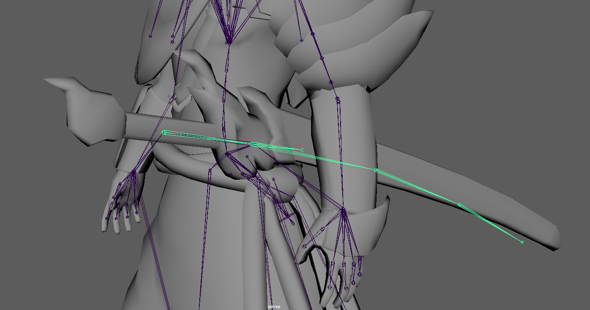

Try to place it like the original weapon was. Put it somewhere on the weapon bone, as close as possible to the original weapon's position. 

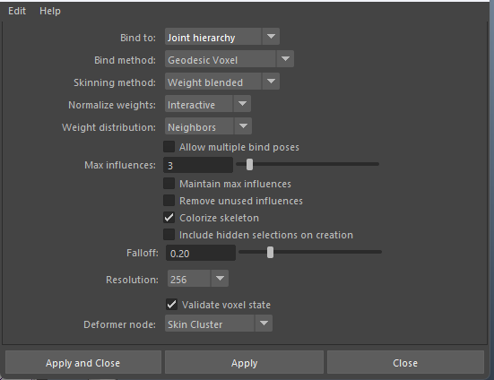

## Binding the Skeleton 

We will now bind the skeleton to our model! To do this:

1. Select your mesh(es) and the Root of your skeleton.
2. Go to the Rigging tab, Skin > Bind Skin.
3. Open the options by pressing the little square on the right side.

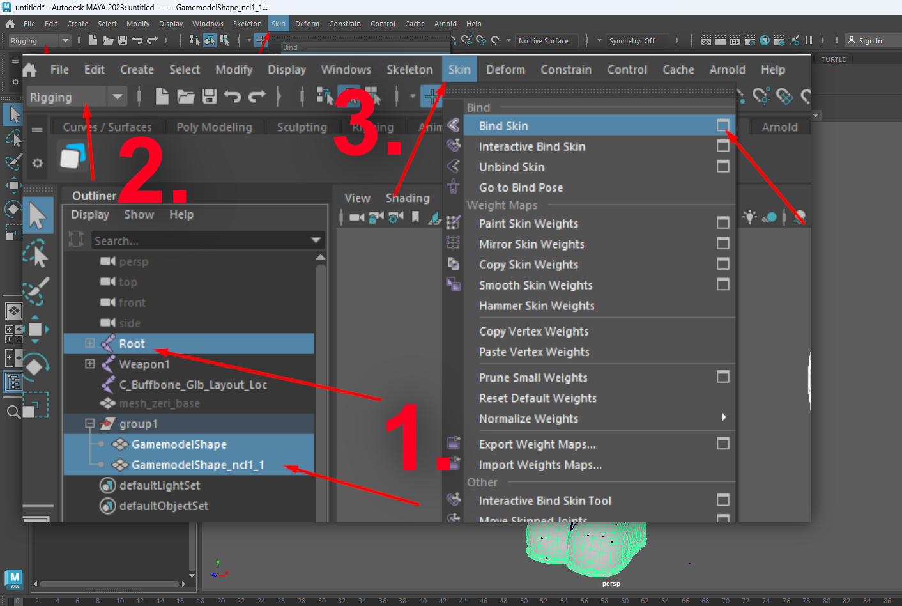

Now that you are in the options, try to copy my settings here:

- Make sure to bind to the Joint Hierarchy.
- Set the max influence TO A MAXIMUM OF 4 (I highly recommend 3, and go lower if your mesh doesn't have many polygons/faces).
- Remove "Maintain max influences."

Of course, make sure the deformation looks good by rotating different joints, like the shoulders, the legs, the spine, etc.

If the first settings didn't do a good job, unbind the mesh first and try these ones instead. (The unbind option is at the same place as the bind skin option.)

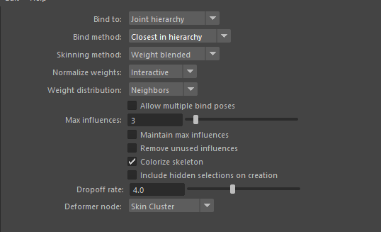

## Weighting Your Character

I will not be going over this step, since it's a pretty big one and we already have another tutorial for it!

You can follow Yoru's weight painting guide [here!](https://youtu.be/LxO4djdtxJg?si=D9QrBaDeyVQ_eaqu)

## Getting the New Model in Game

Once the weight painting is done, you are pretty much good to go! You can now export your new [.skn](/specific-guide/filetypes) and [.skl](/specific-guide/filetypes) into your asset folder. Simply replace the `skn` and the `skl` will update automatically.

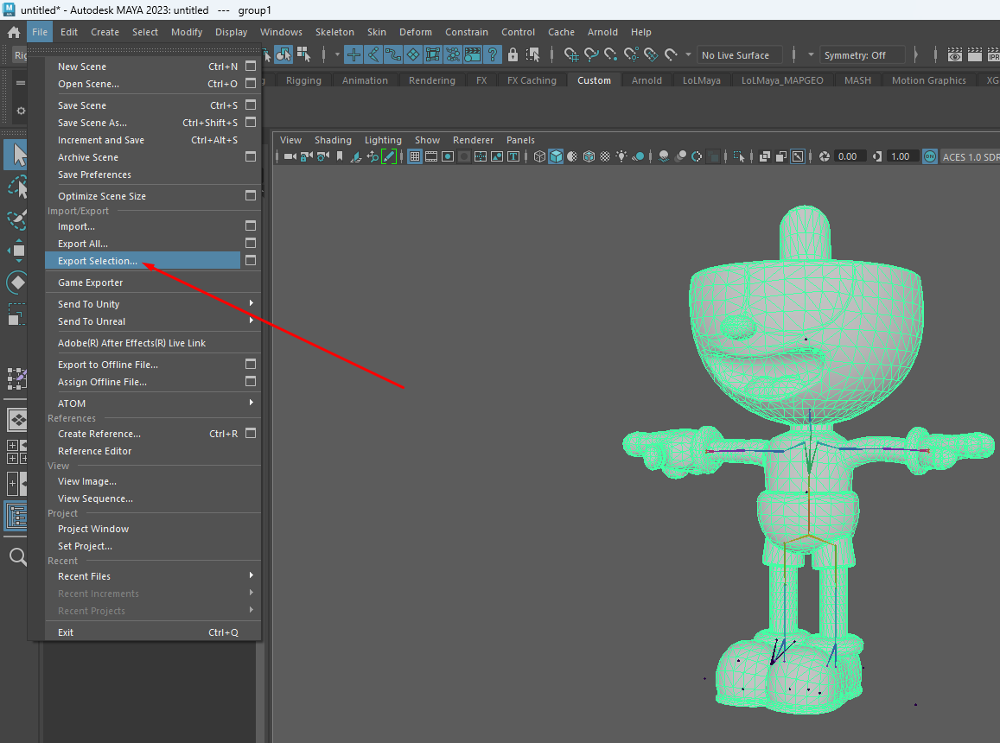

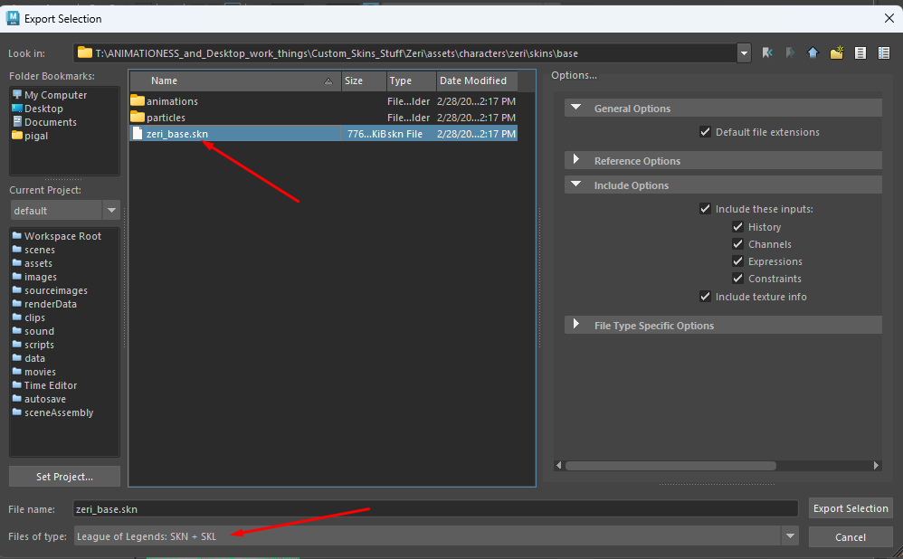

:::note
Remember to select `League of Legends: SKN & SKL` !
:::

You can now drag the client folder into csLoL and run the program. Rename the folder containing your asset and data folder to `Champion.wad.client` and just drag and drop it in CSLoL; it will create a new mod named after the folder you dragged in.

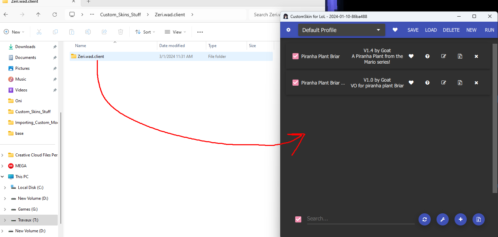

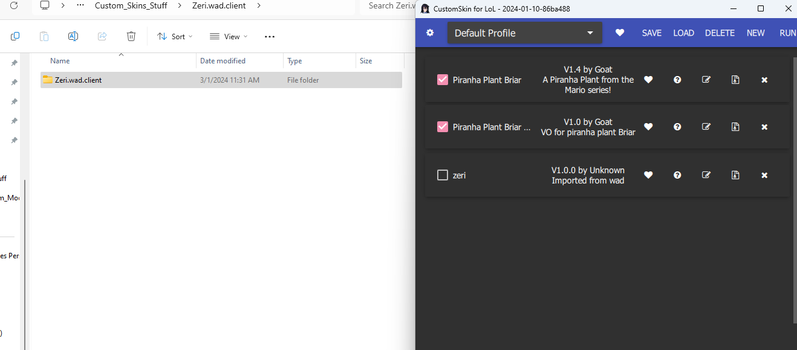

You should now see your model in game!

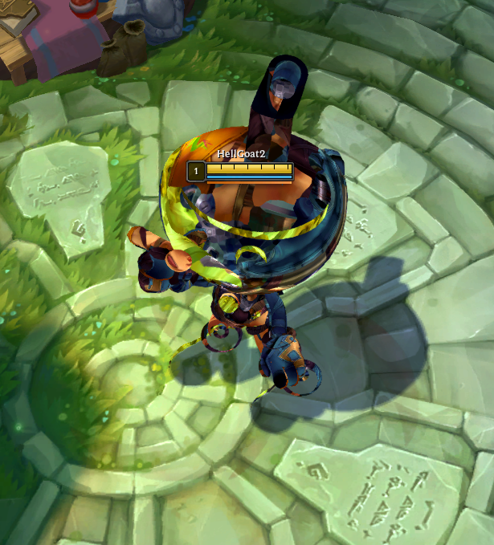

A little strange, though...

### Getting the Textures

Usually, when getting your model online, you should also have a set of texture files included alongside it.

It's possible that you will find different weird files. We only want the colored ones. In my case, these 2.

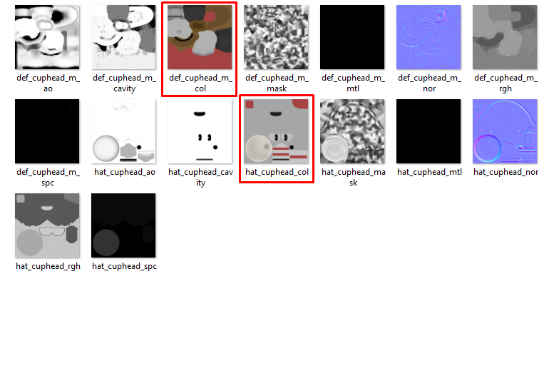

Now, in Maya, assign the "Body" material to your mesh. Since most, if not all, League champs have that material, the game will then be able to detect it and assign the right material to it.

Select your mesh, then, while holding right click, Assign Existing Material > Body.

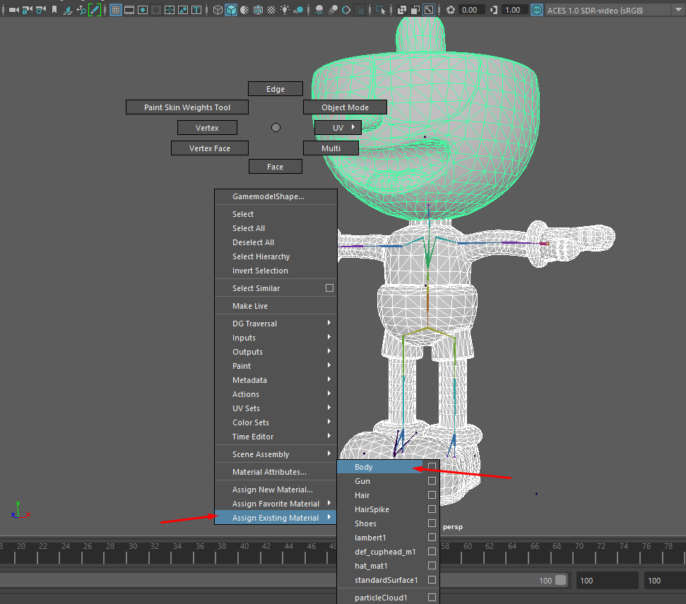

:::note
If your original model has multiple different Materials, go check out the following tutorial!
:::

- [Create skins with multiple materials.](/specific-guide/texturing/create-skin-with-multiple-mats)

We also need to reverse our normals, or else the character is going to look see-through in game.

With your mesh selected, go to the Modeling Tab > Mesh Display > Reverse.

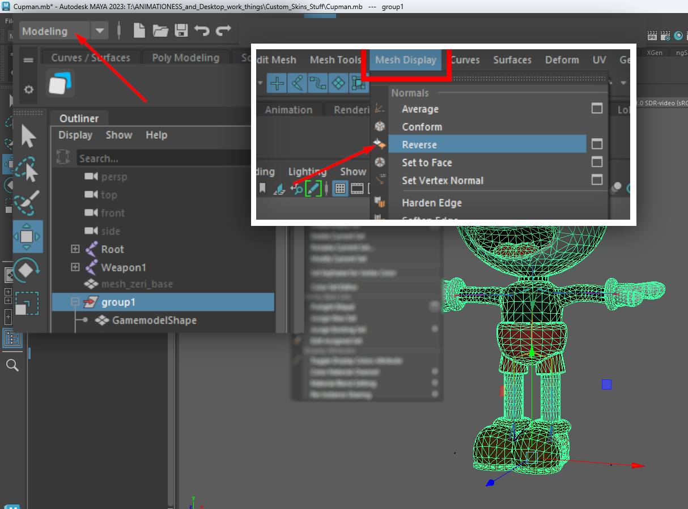

Finally, don't forget to replace the texture file in your assets folder! Replace the body texture, usually `champ_base_tx_cm`. The files with the suffix `2x_` or `4x_` are used for lower quality texture settings, so swap them too! Or else the skin will look strange in lower settings.

**This is only required for `dds` files, regardless of champion.** Tex files do not need these smaller, duplicate files. If the champion uses `dds` files by default, you can edit their `bin` to use `tex` to avoid the use of `2x,4x` files.

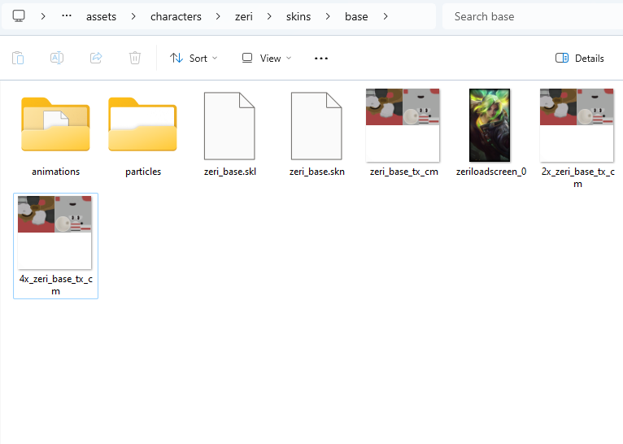

:::note
League only accepts `dds` or `tex` files, depending on what your bin says! You can use GIMP, PaintNET, Photoshop with the Intel Texture Works plug-in, or Photopea to export them as `dds` ! If you want or need tex, you can convert dds files to tex with [tex2dds](https://github.com/Morilli/Ritoddstex/releases/latest) or [LtMAO](https://github.com/tarngaina/LtMAO).
:::

And those are the basics! You should now have your new model in game!

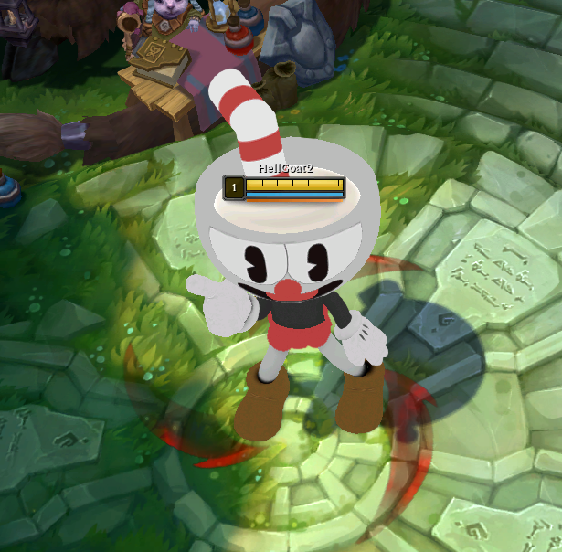

