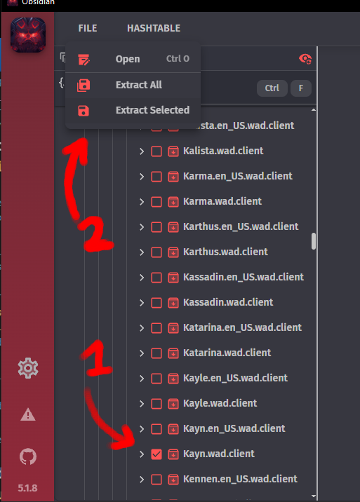
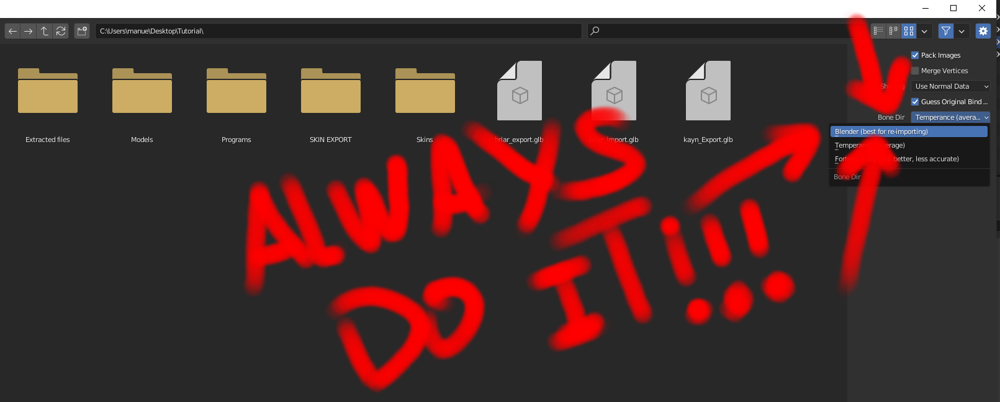
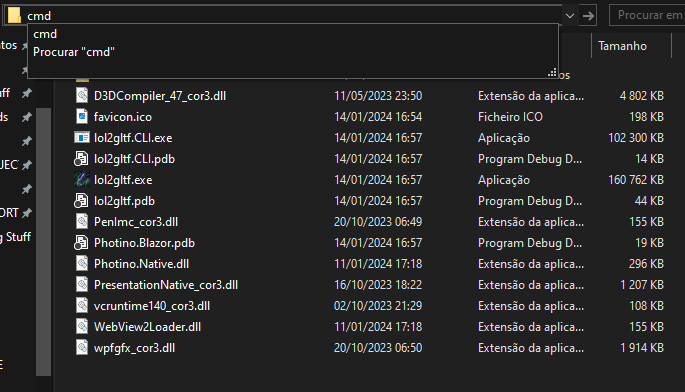
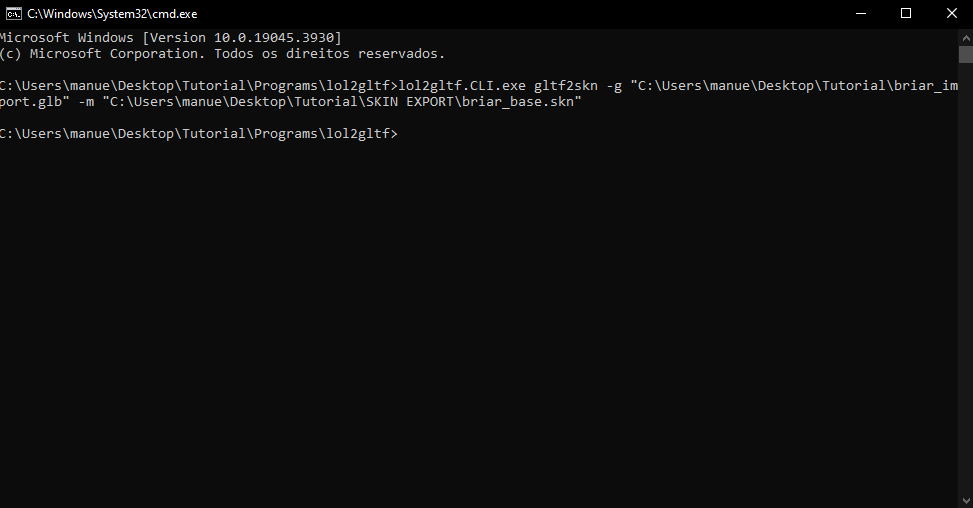
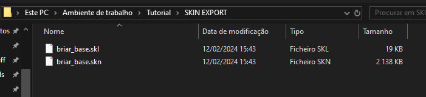

This guide will help you start making custom skins on Blender, having the tools needed, how to use them, and quick videos to explain every single one of these steps
## Tools Needed

- [Blender *Redirect to Download Page*](https://www.blender.org)
- [Obsidian *Redirect to our Download and Guide page*](/core-guides/tools/obsidian)
- [lol2gltf *Redirect to Download Page | **Make sure you download both, the .exe and CLI.exe!***](https://github.com/Crauzer/lol2gltf/releases/tag/3.0.3)
- [Paint NET *Redirect to Download Page*](https://www.getpaint.net/download.html#download)
## Tool Installation
### lol2gltf
- Create a folder called "lol2gltf"
- Copy both "lol2gltf.zip" and "lol2gltf.CLI.zip" into the folder
- lol2gltf is now ready to be used by clicking "lol2gltf.exe"

## Extracting 3d model to edit in Blender ([Video Tutorial](https://www.youtube.com/watch?v=HXfCIvMYYOY&list=PLs0PAKp5tPPvXdbtx012Or5-n9udpG00B&index=2))
- Open Obsidian
- Search the champion you want the 3d model (in Game/DATA/FINAL/Champions. an example of a champion is *Kayn.wad.client*)
- Click the checkmark of said champion then go to "File" and "Extract Selected". Make sure you extract it on an empty folder(create a "Kayn" folder for example)

- Close Obsidian, and open "lol2gltf"
- Resize the window as needed then click on "Select Simple Skin"
- The simple skin should be located on *"FOLDER/Kayn/assets/character/kayn/skin/base"* for the base skin, while the other skins are numbered depending on the number of skins of the champion

- Select the .skn
- Click on "Select Skeleton" and select the .skl
- After that, you need to select the textures for the champion. Most of them have only one, but you can encounter ones with more than 1 Material like Udyr or Kayn. Make sure to select the correct ones as most are pretty self explanatory *("Kayn_Base_Assasin" is the assasin form for example, and all the textures regarding it come from the same image)*

- Scroll down in lol2gltf and click the "GLTF" button
- Save the glb file wherever you want
- Open "Blender"
- Go to "File", "Import", "gltf2.0"
- **MAKE SURE YOU CHANGE BONE DIR TO "Blender"**

- Select your file
- You should be able to see the model imported into blender
- If the model has various materials interlapping eachother, you can hide them by changing them to "Alpha Clip" (see video for example)
## Import Model back to League ([Video Tutorial](https://youtu.be/Zkswkr_uEz4))
- Save the 3D Model in Blender as a GLTF 2.0  file
- Modify the following command to fit your files
`lol2gltf.CLI.exe gltf2skn -g "skin exported from blender" -m "league of legends .skn file"`
For my example, the command would be
`lol2gltf.CLI.exe gltf2skn -g "C:\Users\manue\Desktop\Nova pasta\briar_import.glb" -m "C:\Users\manue\Desktop\Nova pasta\SKIN EXPORT\briar_base.skn"`
- Go to the "lol2gltf" folder
- Click on the search bar, and type "cmd" as shown below

- A command box should appear
- Paste the command from before
- If it worked, it created a .skn and .skl file on the export location you provided

---
### If it didnt work, check the following
- Make sure all the meshes are joined
- Make sure the command is correct
- Ask for help on Runeforge's Discord

---
- You can replace the skn and skl files inside "assets/character/briar/skin/base"
- Import the skin using cslol or equivalent(check video)