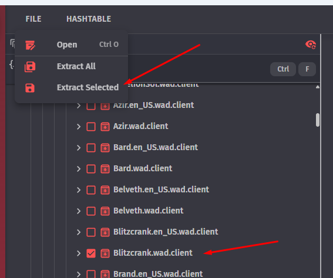
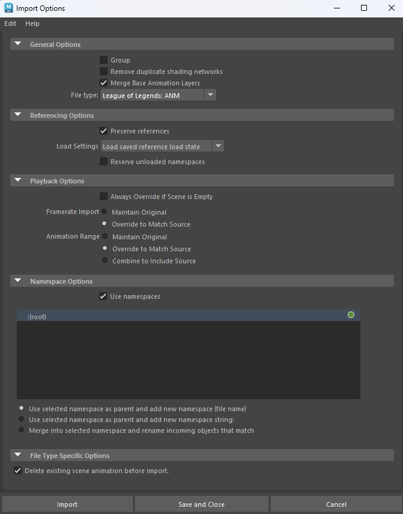
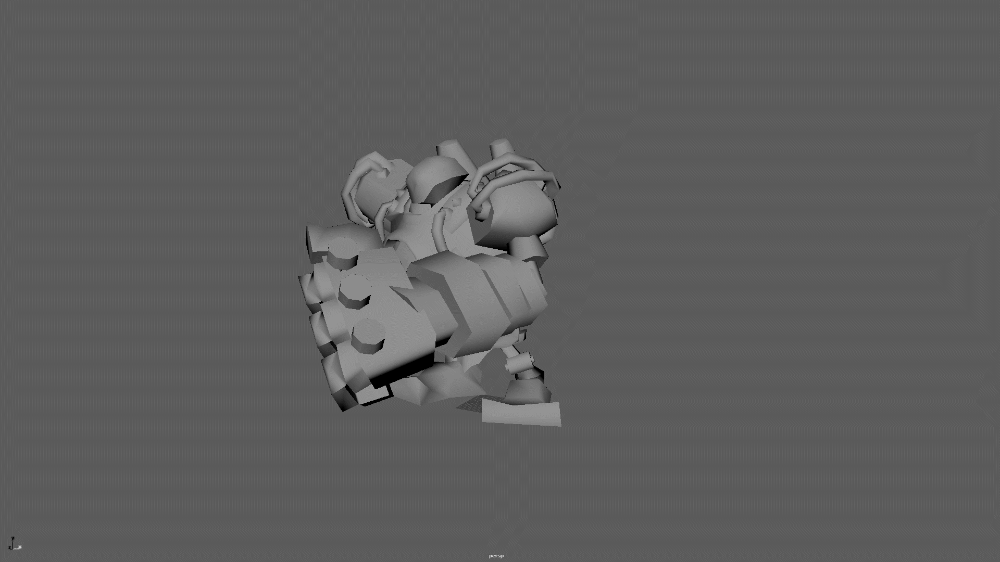
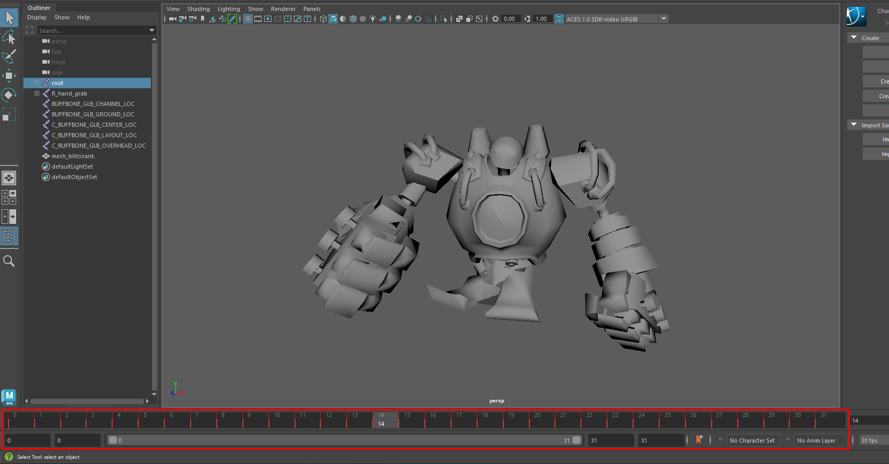
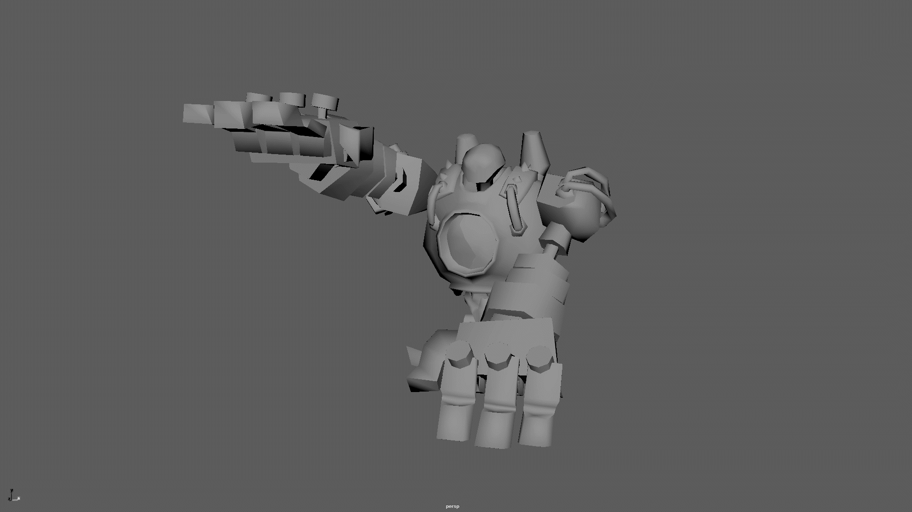
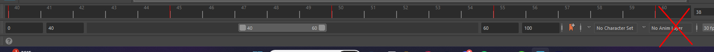
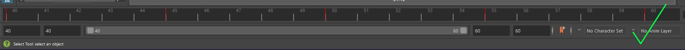
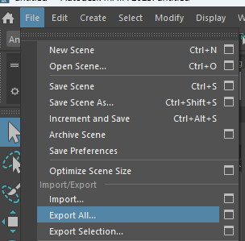
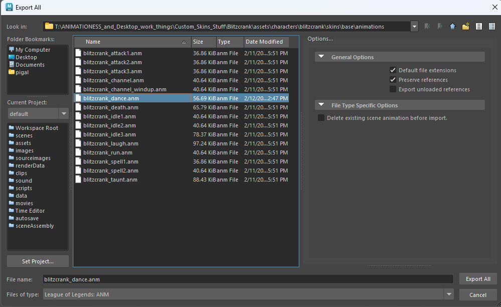
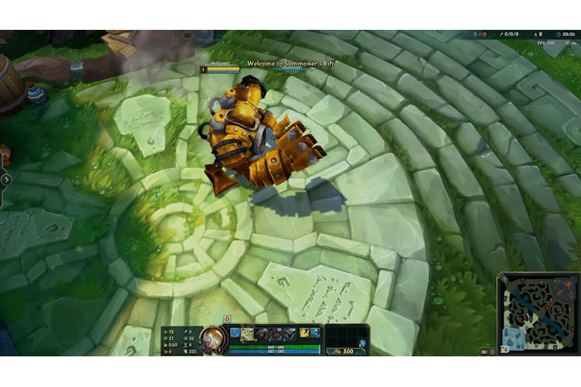

This guide will help you import animations in maya and export them for League modding.

## Tools Needed
-   [Obsidian *Main program to extract and browse Leagues gamefiles.*](/core-guides/tools/obsidian)
- [Maya 2023 *Program to create, edit, animate or rig 3D models*](/core-guides/tools/maya)
- [LoL-Maya *Plugin made by tarngaina*](https://github.com/tarngaina/lol_maya)

### Before you begin animation stuff
I strongly suggest you first get familiar with how to import [.skn](/specific-guide/filetypes) and [.skl](/specific-guide/filetypes).

## Importing

### Extracting what you need

Firstly, you want to extract your desired Champion folder with Obsidian (for this post, I will be working with Blitzcrank). 

Once extracted, navigate to the location where you extracted it and find the animation folder (Should be something like assets\characters\character\skins\base\animations).

### Importing the animation in Maya

Make sure these are your import options :

With the model in the scene (import the [.skn](/specific-guide/filetypes) and [.skl](/specific-guide/filetypes) first), simply drag and drop the animation you want (should be [.anm](/specific-guide/filetypes)) to see in the viewport, and VOILA, you have your funny Blitzcrank walk in the Maya scene.

## Exporting
### Setting up the timeline
Now, if you want to Export an animation, you will want to specify the frames you want to export. To do that, select the range you want to export in the timeline 

Here, I made a small animation to demonstrate. The animation lasts for 20 frames, but the frames are between frame 40 and 60. To select the frames you want to export, make sure the two numbers are the same in both boxes, so I type 40/40 and 60/60 (this will change depending on YOUR animation lenght)

This is not what you want

This is what you want

The bar needs to be "full"

:::caution
You also need to leave one empty frame at the start! So in my case, instead of 40/40, I would have 39/39
:::

### Exporting the animation

:::caution
Make sure you export in 30 fps!
:::

To export, select File > Export All 

Then, select the animation you want to replace and make sure you export as [.anm](/specific-guide/filetypes)

Annnnnd well done! You now know how to import and export animations for League models!

