## Required Tools

- [Obsidian *Main program to extract and browse Leagues gamefiles.*](/core-guides/tools/obsidian)

Plus **one** 3D program of your choice:

- [Blender *Program to create, edit, animate or rig 3D models*](/core-guides/tools/blender)
- [Autodesk Maya *Program to create, edit, animate or rig 3D models*](/core-guides/tools/maya)

I will be using Maya for this guide.

## Tutorial
This tutorial will teach you how to do Animation Retargeting, which is, in short, reusing an existing animation and porting it to another skeleton.

In my case, I will be putting Star Guardian Ahri's dance into Ornn

From now on, Ahri will be the Main SKL, and Ornn the Targeted SKL

### Getting Main SKL in Maya

You will first want to import the Main SKL into the scene with the desired animation (in my case, the dance).

Import the skn by going to File > Import, changing the "Files of type" to "League of Legends : SKN" and importing your skn. 

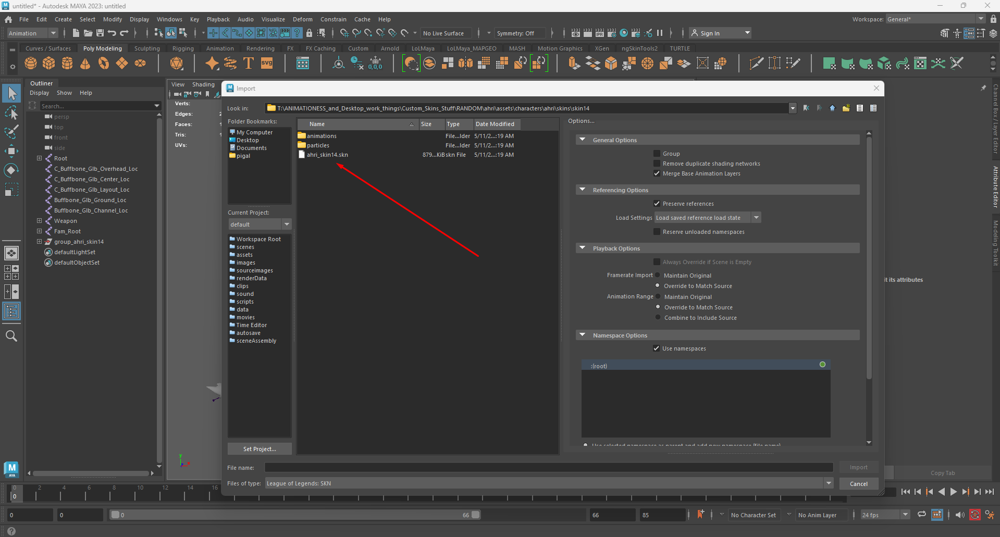

You will then want to import the desired animation. To do so, go to File > Import, changing the "Files of type" to "League of Legends : ANM" then looking for the desired animation. In the import settings, make sure to select "Framerate Import : Override to Match Source" and "Animation Range : Override to Match Source"

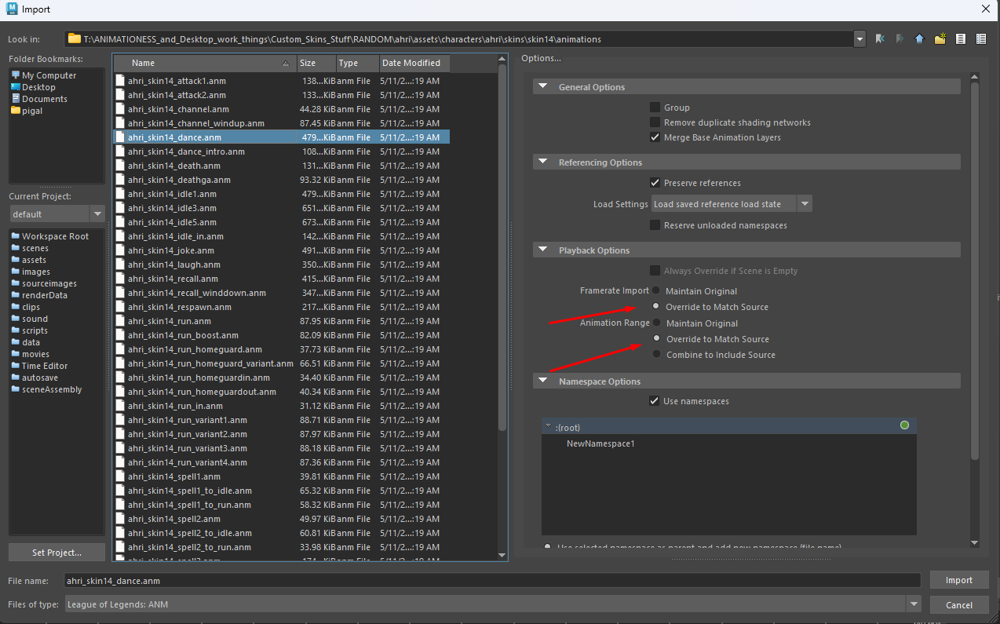

Next select the "Root" bone and add a prefix. Go to Modify > Prefix Hierarchy Names

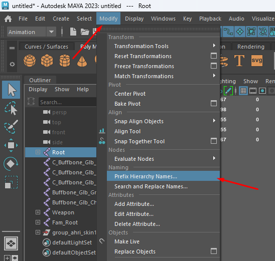

And put anything you want there (I'll put Ahri_ because it looks clean)

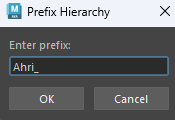

### Getting Targetted SKL in Maya

Now that the Main SKL is all cool and good, lets get the Targeted SKL in Maya as well. To do so, do the same thing as before : File > Import, and find the desired skn to import.

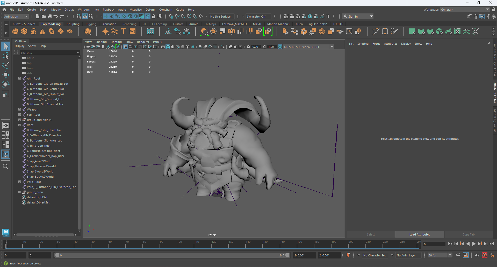

Now that we have both skeletons in the scene, lets begin the Retargetting! 

First, make sure that the arms are parallel to each other, this is necessary for the Retargeting to work. The Targetted SKL should have the same arm angle as the Main SKL, so if the Main SKL's arms are in A-Pose, put the Targetted SKL in A-Pose a well. You would do the same for a T-Pose.

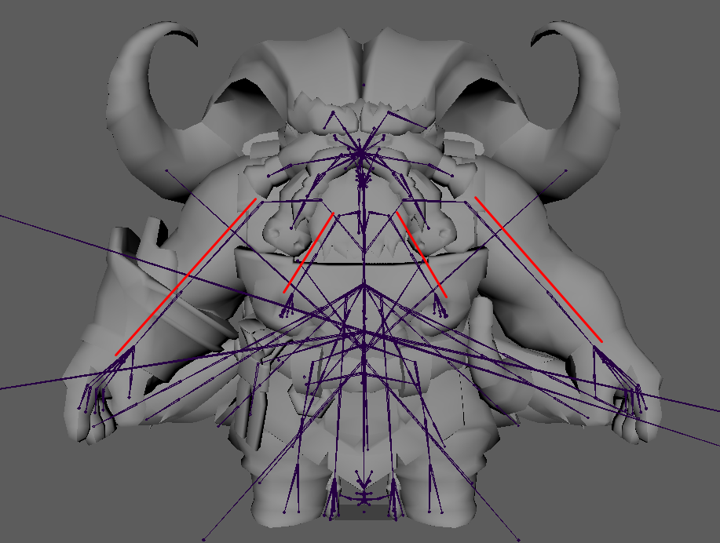

Lets hide the mesh and skeleton from the Main SKL first by going into the outliner, selecting the mesh and skeleton, then pressing H. They should now be grayed out.

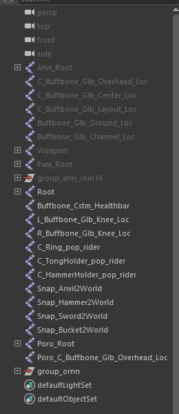

Click the little t-posing dude in the top right corner of maya, and then "Create Character Definition"

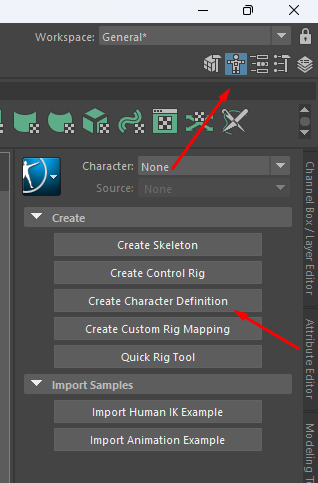

You will now see a big scary man appear! Click that little bone icon right above the Viewport, it will allow you to see the bones trough the mesh.

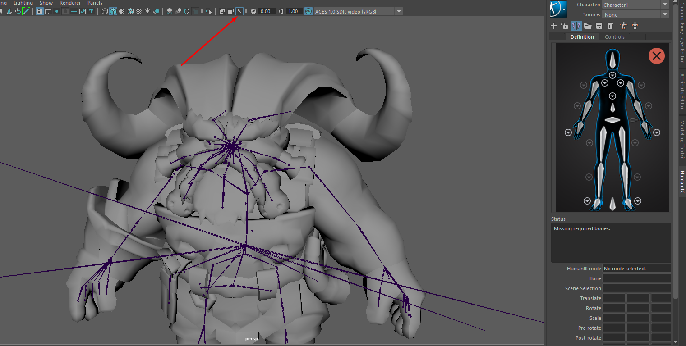

It is now pretty straight forward, you double click on the arm of the scary man, then click on the bone corresponding on the Targetted SKL skeleton. EXEMPLE: The left shoulder with the left shoulder, etc.

When double clicking the scary man's shoulder, you will notice that the rest of the bones get grayed out. Like so : 
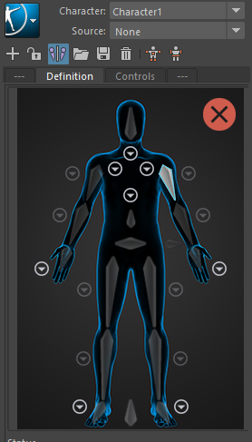

This means that you have selected the bone succesfully.

Now, I would click the left shoulder of the Targetted SKL, since that is the bone I selected on the scary man.

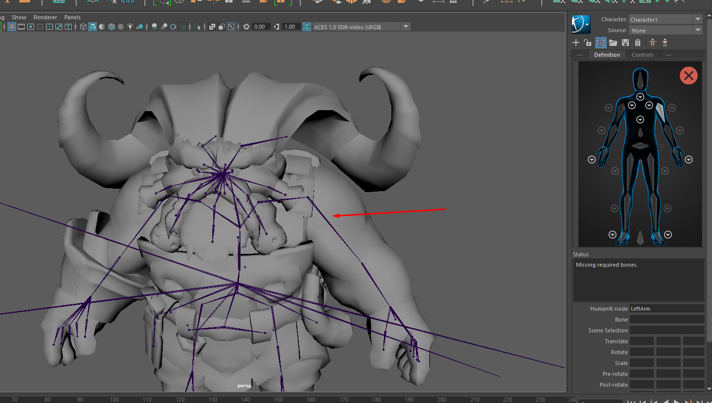

Both left arm and right arm should now turn green on the scary man, this means that the bone was assigned succesfully.

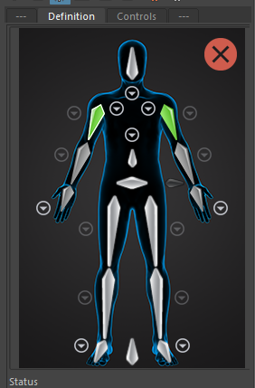

You will also notice some arrows pointing down on the scary man. Those are there to select the Clavicles, Fingers, Toes, Spine and Neck. It is important to fill them out of you want the animation retargetting to be better!

In the end, it should look like something like this :

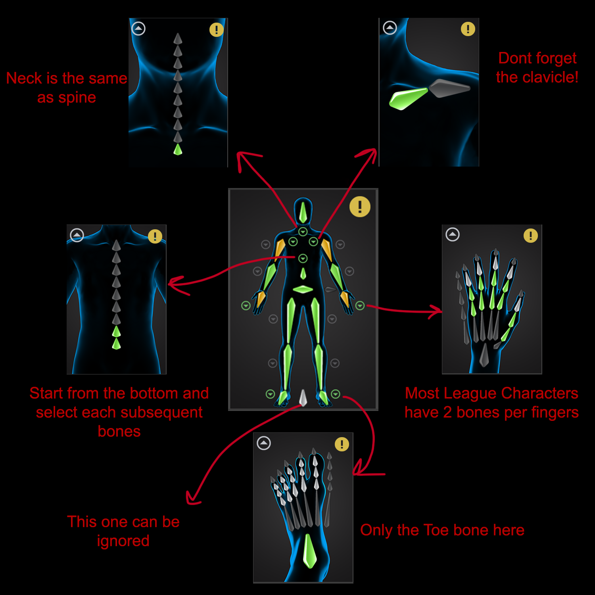

Once thats done, lets do the same for the Main SKL. Start by hiding the Targetted SKL bones and mesh and unhidding the Main SKL by selecting them and pressing H, like before.

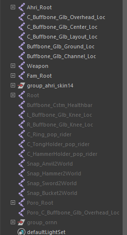

Now, above the scary man, you will find a little "+" icon, click it. This will create a new character definition.

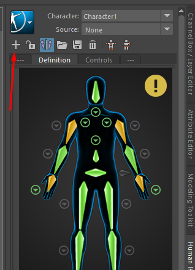

And now, do the same thing again, double click the scary man's bone and then the Main SKL bone. It is important to fill the EXACT SAME THINGS as you did with the Targetted SKL, so same ammount of spine bones, same ammount of fingers, etc. If that is not possible, (for exemple, Ornn has one more spine bone then Ahri) you should then assign the main spine bone from the scary man (the one right above the hips) to the first spine, then, in the spine menu, select the rest of them.

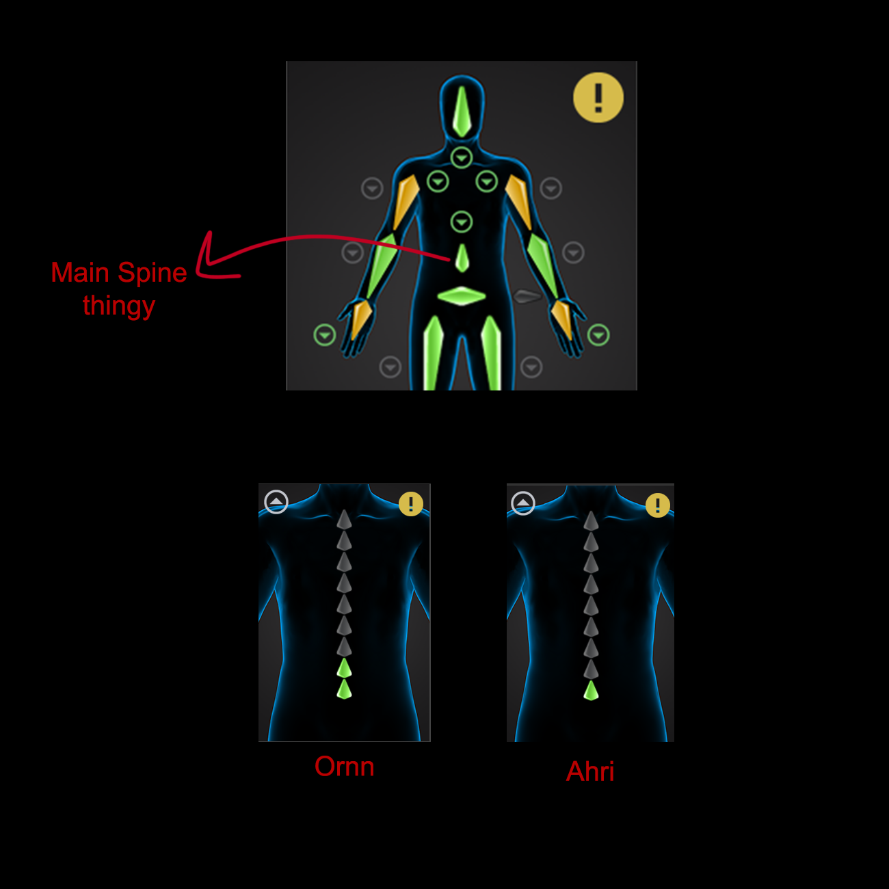

Once that is done go back above the scary man menu and put "Character 1" in "Characters" and "Character 2" in "Source".

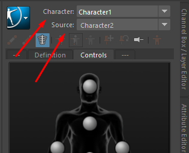

And now see the magic unfold!

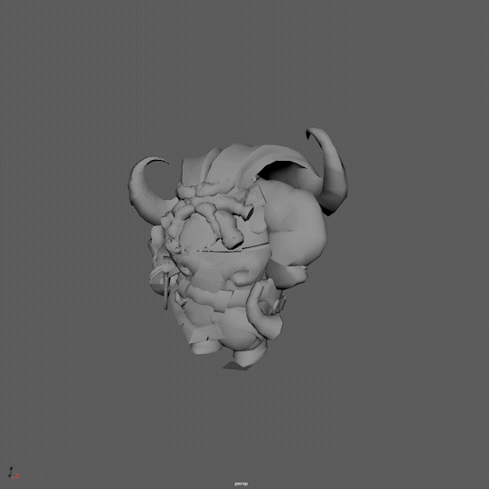

Now, the only thing left is baking the animation and export it in game! To bake animation, click the blue square > Bake > Bake to Skeleton

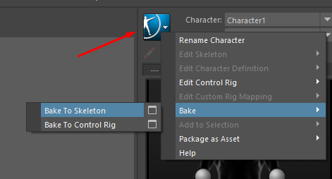

To export the animation follow this guide here :
- [Importing and Exporting Animations](/specific-guide/animation/importing-and-exporting-animation)

And done! 

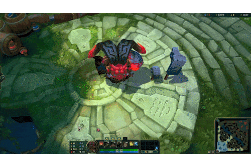

