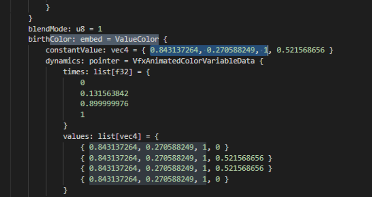
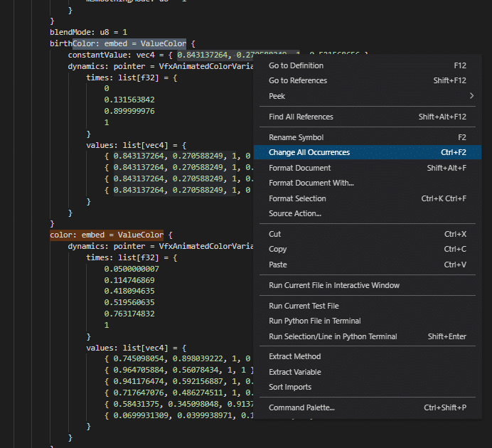
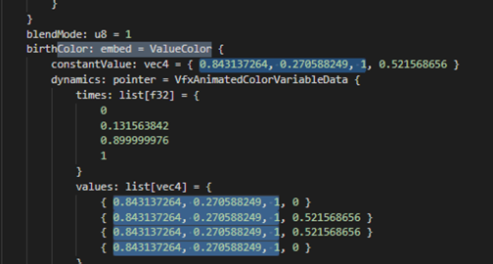
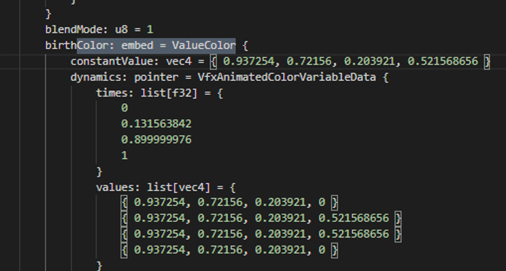

## Required tools

Extractor and Converter:
- [Obsidian *Tool to explore and export Riot Game files*](/core-guides/tools/obsidian)
- [Ritobin *Tools to translate bin files into Python files*](/core-guides/tools/rito-bin)

An code editor of your choice:
- [Choose any Code Editor *Visual Studio recommended*](/core-guides/tools#code-bin-editing)

If you choose Visual Studio Code, you need the [Python extension](https://marketplace.visualstudio.com/items?itemName=ms-python.python) aswell!
*Other editors work aswell, aslong as they can edit .py (Python) files.*

A calculator or:
- [Wooxy Plus *Very old tool which is mostly outdated but can be used to calculate color values*](https://drive.google.com/file/d/1Lj-TMFXve-QuCOeYN9v4QeBXpXaaoTgc/view)

*Your antivirus may flag this prgram, it is of course safe!*

## Guide
### Color Codes
1,1,1,X = White0,0,0,X = BlackShould be left like this as it can distort the look of particles.

### Edit multiple same values in Visual Studio Code
Sometimes you have blocks like this, where you have multiple lines with only the same color value.
To select them all at once, first of all select one of the lines with the 3 values you want to replace.

Now you rightclick and select “Change all Occurences”

Then it selects all lines

Now you just paste in your values and done.

### Video Guide

*External Youtube Link!*

## Sources
- Yoru Queen of Night
