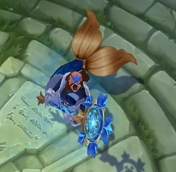
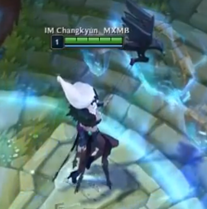
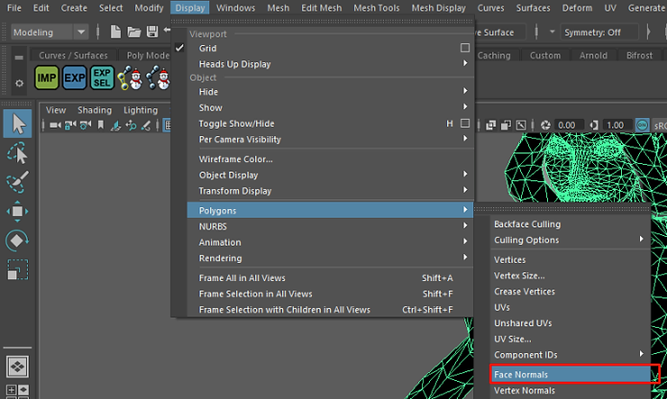
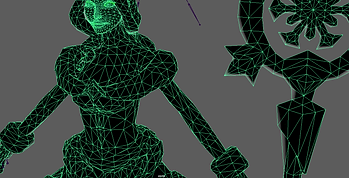
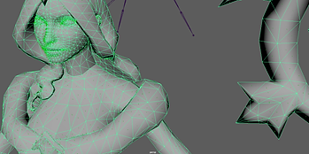
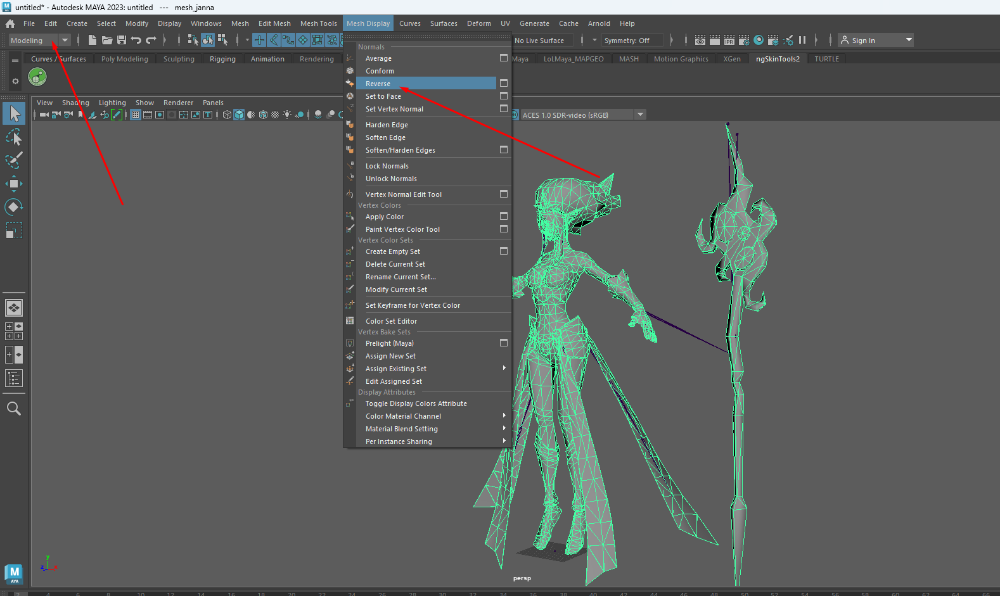

How wrong face normals in-game are usually noticeable:

This is more common, where the whole character or connected parts appears kind of see through.

 

Staff is missing from certain angles, rather uncommon to just have a few face normals wrong.

You can check face normals in Maya here:

#### Correct
Barely visible green dots (if visible at all)

#### Incorrect

Small green lines, very visible around “crowded” areas (face)

### How to fix

The fix is very simple : 

Select your mesh, then, while in the modeling tab, go to Mesh Display > Reverse

Your model should now appear normal!

## Sources

- Yoru Queen of Night
