## How to repath animations
Animation repathing ensures custom animations in games are applied to specific skin only, preventing them from affecting other skins. Without repathing, a custom animation may unintentionally override animations for other skins.

Here's an example of base custom skin Gragas animations overriding Hillybilly Gragas's animations.
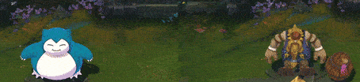

### Required Tools
-   [Obsidian *Main program to extract and browse Leagues gamefiles.*](/core-guides/tools/obsidian)
- [Choose any Code Editor *Visual Studio Code is recommended*](/core-guides/tools#code-bin-editing)
- [Ritobin *Tools to convert bin files into Python files*](/core-guides/tools/rito-bin)

## New Animation Repath Tool!
Here's a new tool designed for creators who don't want to waste time and aim to make their workflow easier — introducing **lolAnimPath**.

### LolAnimPath
lolAnimPath is a lightweight and easy-to-use tool designed for League of Legends custom skin creators. It allows you to repath animation files, ensuring that your custom animations do not override the default animations of other skins. Head over to GitHub for more details.

- [lolAnimPath *Tools to easily modify and repath animations*](https://github.com/Nyht7/lolAnimPath)

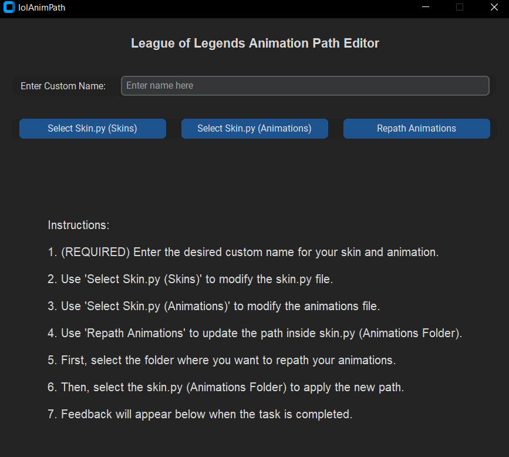

## Tutorial

### Creating a new animation folder
To begin, we’ll create a dedicated folder to store all custom animations. This folder will act as the central location for your unique animations, keeping them organized and separate from the default game files. By saving your custom animations here, you’ll have easy access for future modifications and ensure they don’t accidentally override other animations. This organized approach is essential for efficiently managing animations and linking them later to specific skins or champions without affecting others.

for example on `Gragas.wad.client/assets/characters/gragas/skins/base`
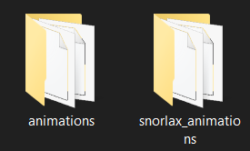

### Renaming the Skin0.bin file in the Animation folder
In this step, we’ll rename the existing `Skin0.bin` file, which represents the base skin and, by default, overrides animations for all other skins. Rename `Skin0.bin` to a unique name to link it specifically to your mod, which will prevent it from unintentionally affecting other skins. You can name it anything you like, but in my case, I’ll be naming it `snorlax.bin` to match my theme. This ensures that the custom animations remain isolated to the intended skin only.

This file is located at `Gragas.wad.client/data/characters/gragas/animations`
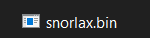

### Repathing the animation path in Skin0.bin (skins folder)
Next, we’ll edit the animation paths in the `Skin0.bin` file (found in the skins folder). 

This file is located at 
`Gragas.wad.client/data/characters/gragas/skins`

Within this file, there are two paths we need to update: 
`linked:list[string] = {}`

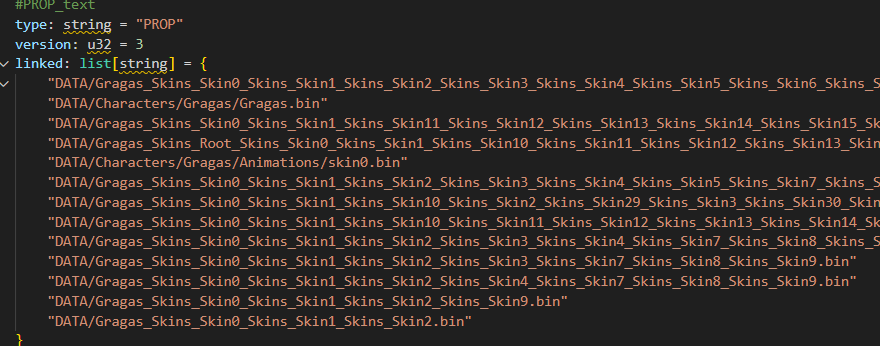
and `animationGraphData: link = ""`.

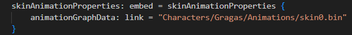

These paths define where the game looks for animations, so changing them will direct the game to use our custom animations instead of the default ones. Make sure to replace these paths with the file path of your custom animations, ensuring they align with your modded skin folder. This step is crucial for linking your unique animations to the correct skin.

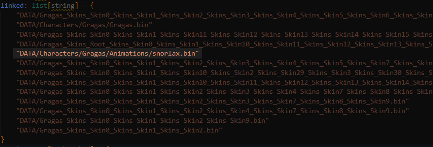

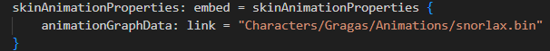

edit: no need to put `.bin` on the 2nd screenshot

### Repathing the animation paths in Skin0.bin (animation folder)
Lastly, we’ll edit the animation path in the `Skin0.bin` file (found in the animation folder). 

This file is located at 
`Gragas.wad.client/data/characters/gragas/animations`

#### Original
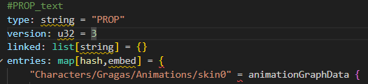

#### Edited
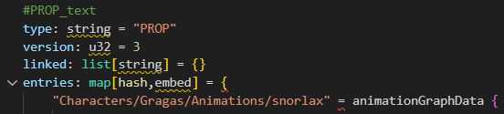

also, update the animation paths within each `AtomicClipData {}` section. This step involves repathing all individual animation references to point to your custom animations. By doing this, you ensure that each animation clip is correctly linked to your modded files, preventing conflicts with other skins and keeping the animations specific to your custom skin.

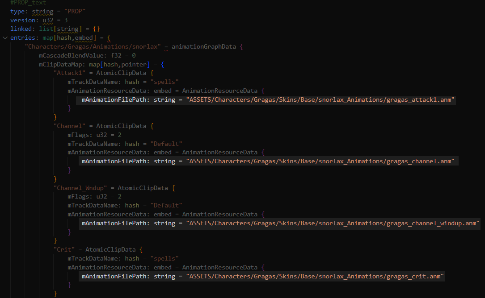

### Result
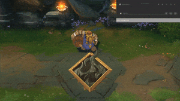

Now, the custom animations will no longer override other skins. By properly updating the animation paths, your custom animations will only apply to the intended skin, ensuring that no other skins are affected by the changes.now all the skins will not be override by the default's custom animations

## Sources
- Nyht
- Goat 