## Explanation of these strange .dds files

Some textures appear like this after you extracted them: They’re just mostly empty.

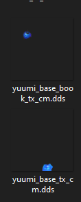

And if you edit them incorrectly, it could end up looking like this:

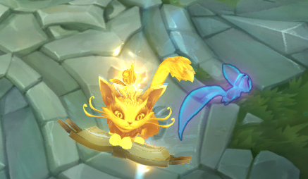

In Yuumi’s case the yellow color shows, what glows when her passive is up.

However, there are multiple textures which have that effect, so you  will need to figure out what exactly the texture and the effect do.

## Required tools

**One** 2D editing program of your choice:

- [Adobe Photoshop + .dds Plug-in: NVIDIA Texture Tools / Intel Texture Works *Program to edit 2D files*](/core-guides/tools/adobe/photoshop)
- [Gimp *Program to edit 2D files*](/core-guides/tools/gimp)

## Tutorial for Photoshop
If you open the image, you can actually see that all the texture is there:

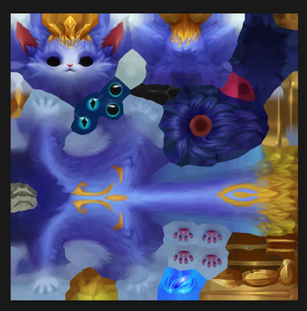

And it’s all handled by an Alpha channel (black means invisible, white means visible):

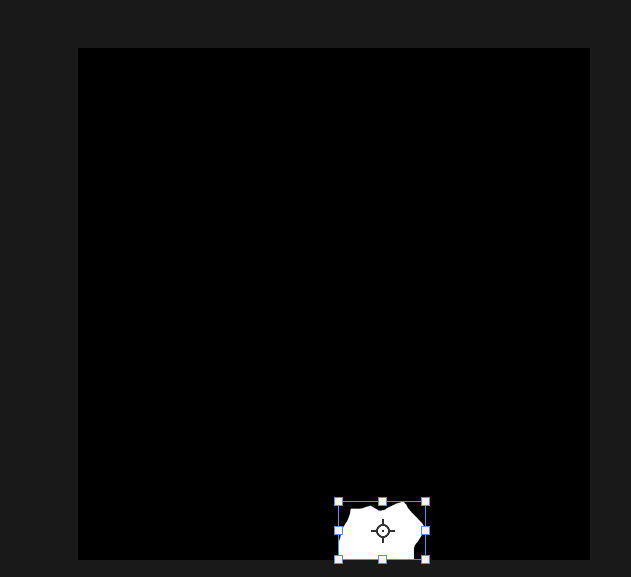

Only the small ball on her “antenna” glows when her passive is up.

In order to make her eyes glow with the passive, I will paint the alpha layer on top of her eyes white too.

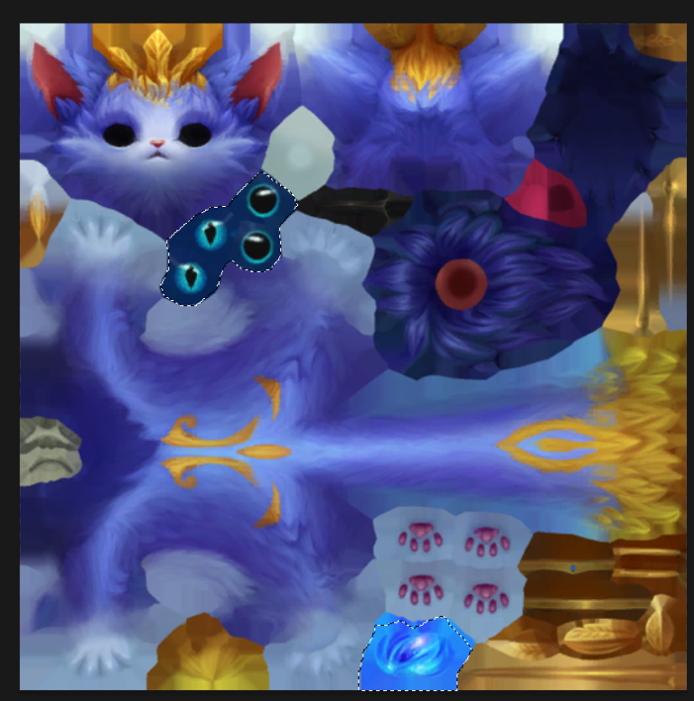

When I save it now, it looks like this:

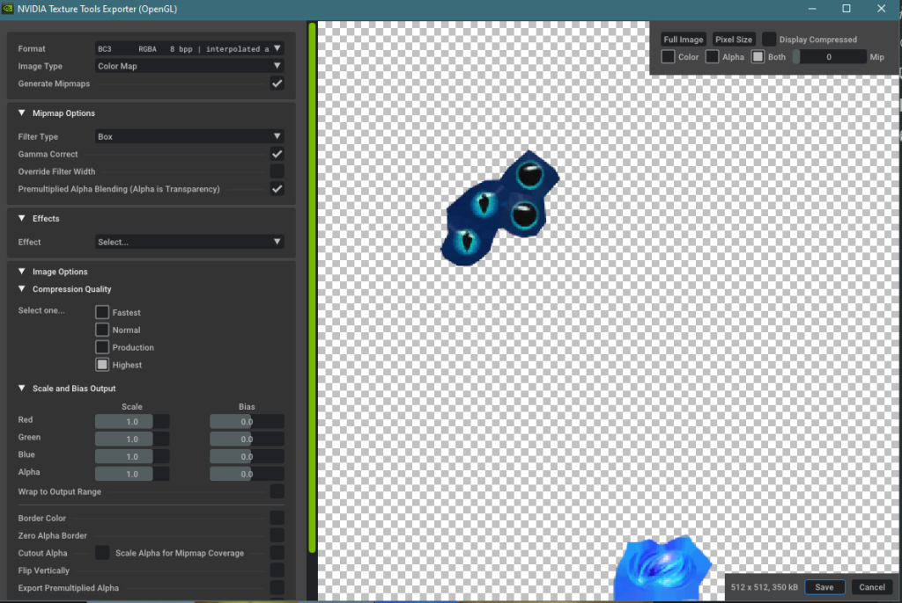

It reproduces the effect of the Riot texture.

## Tutorial for Gimp
When you open the file you are greeted with the same mysterious invisible image you saw in the thumbnail:

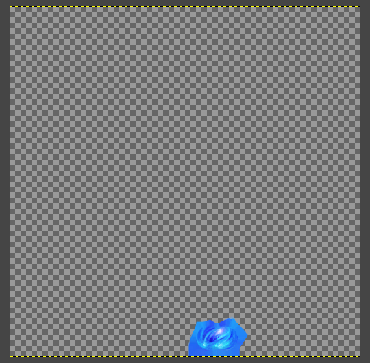
To see original texture go over to “CHANNELS” tab and disable alpha channel:

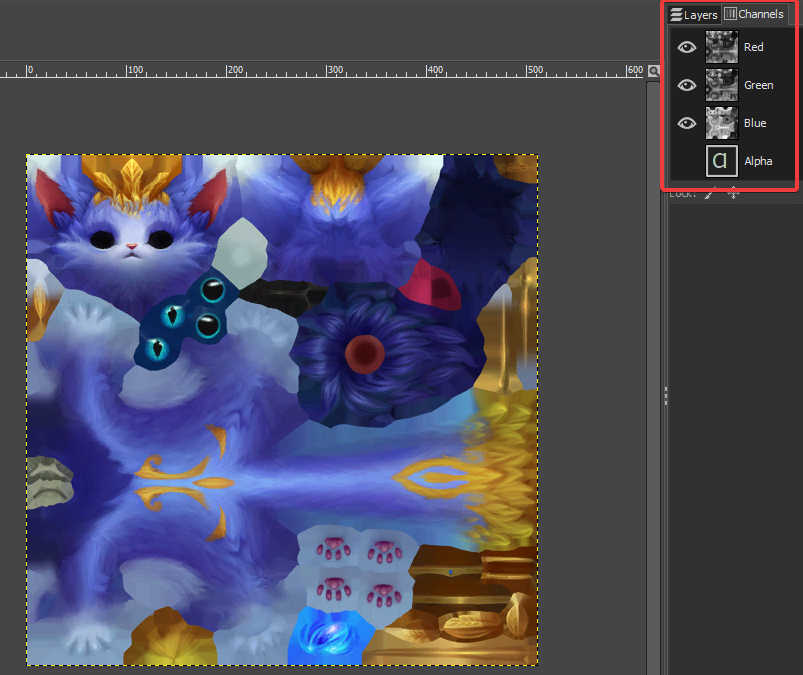

Now go back to layers tab and right click > new from visible:

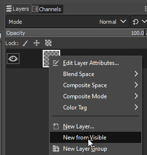

After doing that go back to “CHANNELS” tab and enable alpha channel again.

Now you can edit the texture, however now Yuumi passive glow will be  broken since it is controlled by alpha channel, to enable glow on  certain parts of her texture we need to make a new layer mask. 

First right click on any layer  > Flatten Image.
Then we make a selection using free select tool:

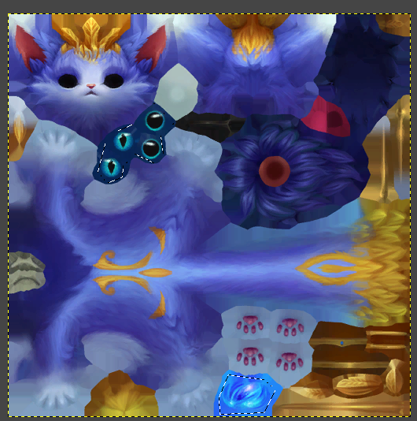

Then right click on layer > Add layer mask:

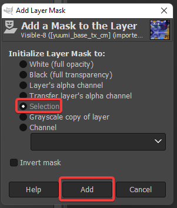

Now when I save the file looks like this:

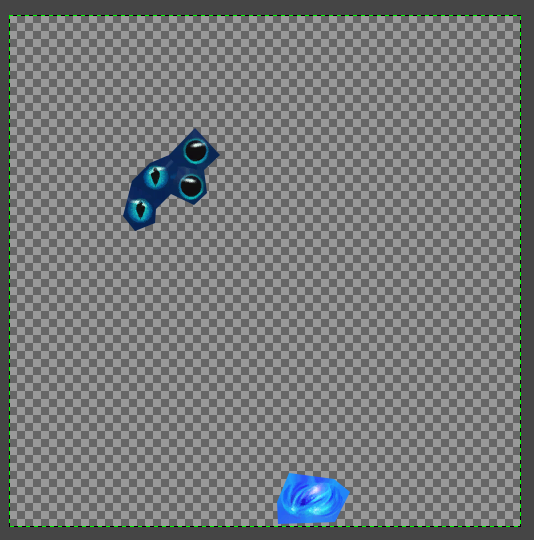

It reproduces the effect of a riot texture.

## Sources

- Yoru Queen of Night

