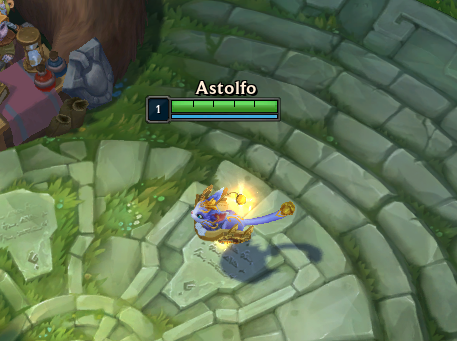
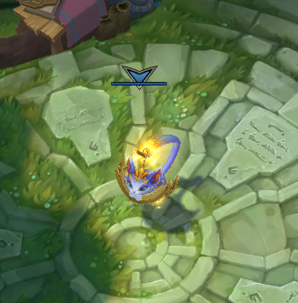
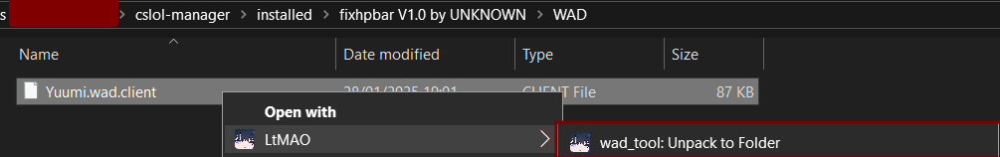
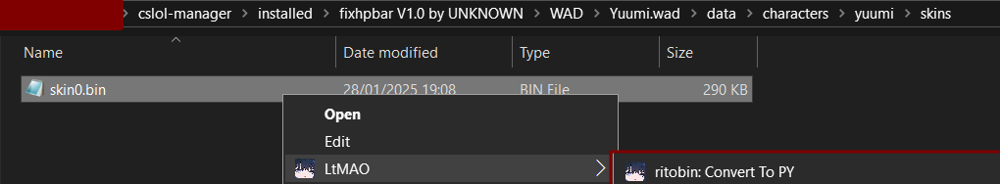
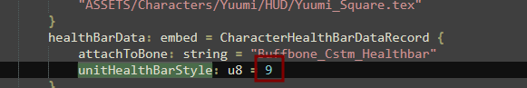
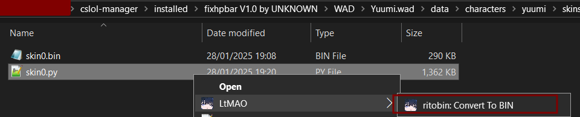
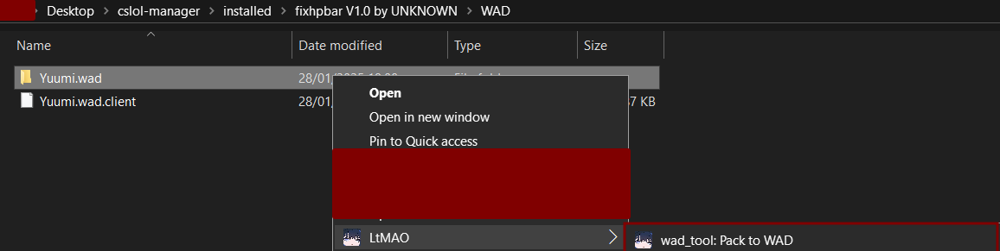
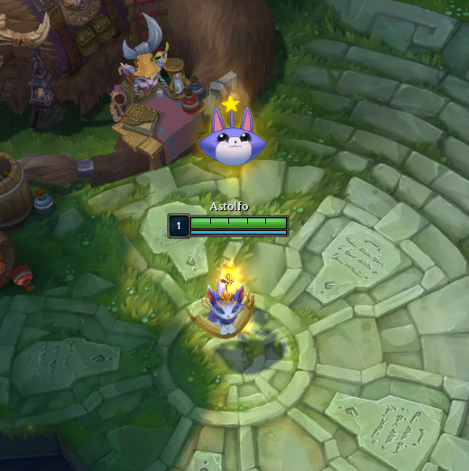

:::note
This tutorial uses LtMAO, specifically the explorer contexts. If you dont have it installed, follow the instructions [here for installing LtMAO](/core-guides/tools/ltmao) and  [here for enabling explorer contexts](/core-guides/tools/ltmao#explorer-contexts).
:::

---
Examples of Broken Healthbars

---
### Overview

Navigate to your `cslol-manager\installed` directory and find the name of your mod. Inside that folder, navigate to the `WAD` directory and extract your `.wad.client` using LtMAO.

You will see a new directory titled `Champion.wad`
Inside that directory, navigate to `DATA\Characters\Character\Skins`. Inside that directory you will see one or more `.bin` files. Convert them to `.py` with LtMAO, then open the `.py` in your text editor.

In your text editor press `Ctrl+F` and search for `unitHealthBarStyle`, it will look something like this:

Change it's value to `12` and save your file. Next, convert your `.py` back into `.bin`.

Next, you need to:

1. Delete the `.py` file.
2. Navigate to your `WAD` directory.
3. Convert the `Champion.wad` directory back to a `.wad.client` file.

After this, delete your `Character.wad` directory, toggle the run button inside `cslol-manager` and youre good to go!

