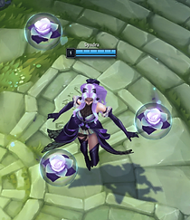
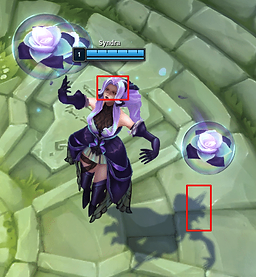
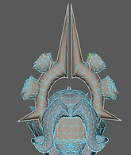
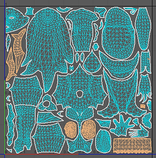
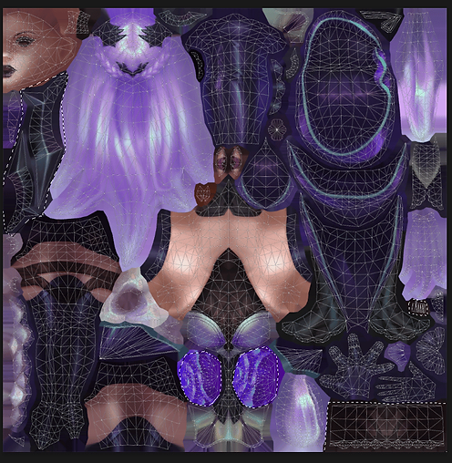
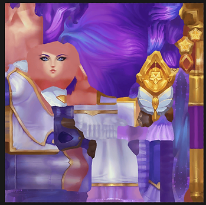
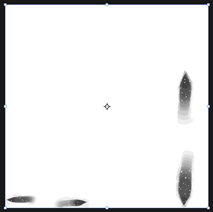
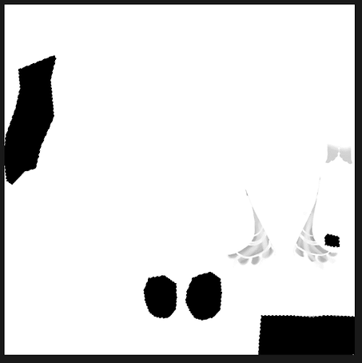
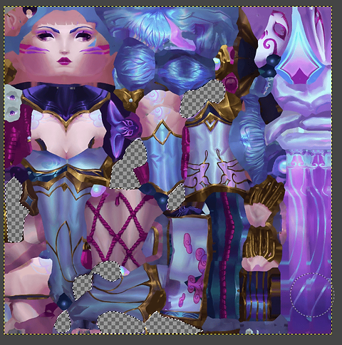

## Required Tools

Any graphic editor that can handle [.dds](/specific-guide/filetypes) files:

- [Adobe Photoshop *Program to edit 2D files*](/core-guides/tools/adobe/photoshop)
- [Gimp *Program to edit 2D files*](/core-guides/tools/gimp)
- [Uvee *to extract the model UV (only fully necessary if you don’t use Maya or Blender)*](https://github.com/tarngaina/uvee)

Something to view your model (not mandatory but very helpful) — either:

- [Autodesk Maya + LoLmaya *Program to create, edit, animate or rig 3D models*](/core-guides/tools/maya)
- [Blender *Program to create, edit, animate or rig 3D models*](/core-guides/tools/blender) with [lol2gltf *Tool to convert League .skn and .skl to gltf*](/core-guides/tools/lol2gltf)

## Infos
To delete small model parts you might not need to actually model edit. Simply making textures transparent might help in a lot of cases, but not all (Initially I wanted to delete Spirit Blossom Evelynn’s crown, which for some reason did not work).

Keep in mind that textures deleted like this will still cast shadows, which will become and issue if you plan to erase really big model portions.

Also the textures are created with the model in mind, so in Syndra’s case she has a really dark forehead and eye area.

Often models are also incomplete, for example if you delete hair that fully covers the side of the head, there might not be a modeled ear. Or if a skirt overlaps the legs, part of the leg will be missing (Secret Agent Miss Fortune).

## Tutorial
Loading your model and extracting the UV
Follow this tutorial to load your model in Blender (or Maya or wherever you can load a model and view models parts and uv) and extract the UV (best watch it until 15:20):

*External link to Youtube!*

### Finding the UV space you want to erase
First select the model parts you want to erase on your model. (I use Maya here instead of Blender, but its very similar).

Make sure to select everything of whatever you want to remove, all small areas and also the back side which can be hard to see sometimes.

Now look at the UV and remember which areas are selected, best leave it open and selected.

Then go into your graphic editor program, load the texture and the UV on a layer on top of it. Make sure that the UV is perfectly aligned in the middle, Photoshop likes being icky with that.

Select the area around the selected UV shells in your 3D programm. I recommend the Polygon Lasso tool.

Make sure to not overlap other UV shells to not delete thing you don’t want to.

The small little nearly rectangle on the right side below the light purple area is the inside of the mask, while the front side is way bigger and in the bottom right corner, so it’s easy to miss the back.

## Finding out what transparency method you need to use
There are 2 methods which are used by different graphic programs and plug-ins: Alpha masks and transparency.

You must find out which one your programm uses in order to make textures invisible.

### Alpha mask
If you load a texture and it it looks solid and has a layer called “Alpha” under channels that’s black and white, you need to use the first method.

### Transparency
If the texture clearly has transparent parts and no Alpha layer under channels (or no channels), you need the second method.

Method 1

I use Photoshop for this one.

Go to the Alpha layer under “Channels”. Then paint all the areas you just selected in fully black.

(The gray areas are already existing transparencies from the skin)
  

Method 2

I use Gimp for this.

Simply take your eraser tool and erase all the selected areas fully.
  

Then save with BC3/DXT5 compression.

## Sources

- Yoru Queen of Night
